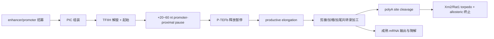

# Pol II 的转录起始、延伸和终止到底在发生什么？

> RNA-seq 的 count 是 Pol II 通过多道闸门后的产物，不只是启动子强弱。

## 长答案

RNA polymerase II（RNA 聚合酶 II，Pol II）负责多数 mRNA 和一部分 non-coding RNA 的转录。Bulk RNA-seq 里一个基因的 read count，表面上像“表达量”，分子层面其实是这条链的总输出：

起始不是 Pol II 单独“坐上 DNA 就开始读”。pre-initiation complex（预起始复合体，PIC）先把 TBP/TFIID、TFIIB、TFIIF、TFIIE、TFIIH 和 Pol II 组织到 promoter 上；TFIIH 打开转录泡后，Pol II 活性中心才开始把 NTP 接到新生 RNA 3'OH 上。这个阶段决定的是“能不能启动”，不是最终 steady-state RNA 数量。

第一道关键闸门是 promoter-proximal pausing（启动子近端暂停）。许多动物基因起始后只走 20-60 nt 就停住，DSIF 和 NELF 稳定暂停复合体。暂停不是失败，而是把基因放在“已起始、等释放”的状态：RNA 5' 端足够长，可以加帽；细胞再通过 P-TEFb/CDK9 磷酸化 DSIF、NELF 和 Pol II CTD，决定是否进入 productive elongation（有效延伸）。所以 promoter 上有 Pol II ChIP-seq peak，不等于该基因一定有高 mRNA。

Pol II 最大亚基 RPB1 的 C-terminal domain（羧基端结构域，CTD）是移动脚手架。CTD 由重复七肽 $Y_1S_2P_3T_4S_5P_6S_7$ 构成。起始附近 Ser5 phosphorylation（Ser5 磷酸化）高，利于招募 5' capping enzyme；进入基因体后 Ser2 phosphorylation（Ser2 磷酸化）升高，偏向 3' end processing、termination 和部分 splicing coupling。它不是“Ser5=起始、Ser2=延伸”的二元开关，而是动态 landing pad。

终止也不是 Pol II 到 polyA signal 就立刻停车。polyadenylation signal 先让新生 RNA 被切开；切点下游仍连着 Pol II 的 RNA 暴露 5' 端，被 Xrn2/Rat1 这类 5'→3' exonuclease 追上并促使 Pol II 解离，这叫 torpedo model（鱼雷模型）。所以 RNA 3' 端定义和 Pol II 离开 DNA，是耦合但不完全同一件事。

把这些步骤压成一个最小动力学模型，可以看到为什么 RNA-seq count 不能只解释成 initiation rate。设 promoter 每单位时间成功起始 $r$ 次；暂停释放并完成有效延伸的概率为 $p$；加工后能成为稳定成熟 RNA 的概率为 $q$；成熟 RNA 降解速率为 $\gamma$。成熟 mRNA 数量 $M(t)$ 满足：

$$
\frac{dM}{dt}=rpq-\gamma M
$$

推导：单位时间进入成熟池的分子数是 $rpq$；单位时间消失的分子数与当前分子数成正比，为 $\gamma M$。稳态时 $dM/dt=0$，所以：

$$
M^\*=\frac{rpq}{\gamma}
$$

RNA-seq 的 read count 近似反映 $M^\*$ 再乘以长度、深度、捕获效率等技术因素。同样的 count 变化，可以来自 promoter recruitment、pause release、RNA processing 或 mRNA stability。Bulk RNA-seq 的强项是总输出；弱点是单独一张 count matrix 通常不能把 $r,p,q,\gamma$ 分开。

## 为什么这么设计

细胞没有把转录设计成“一启动就一路跑到底”，因为 mRNA 不是裸 RNA 字符串，而是需要身份认证和加工的分子。暂停给 5' capping 和信号整合留出窗口；CTD 把 Pol II 从单纯聚合酶变成移动脚手架；polyA cleavage 与 termination 耦合，保证 3' 端定义和 Pol II 回收协调发生。

代价是解释复杂。RNA-seq 看到的 DEG 不是单一调控步骤的读数，而是多个闸门的乘积。要把差异表达解释成“转录因子激活了 promoter”，通常还需要 nascent RNA、Pol II ChIP/CUT&Tag、ATAC、PRO-seq/GRO-seq 或 mRNA stability 实验来分解。

## ⚠️ 容易混淆 / 常见误解

**误解 1**：RNA-seq count 等于转录起始强度。  
为什么是错的：稳态 $M^\*=rpq/\gamma$ 里，起始 $r$ 只是一个因子。暂停释放、加工效率和降解速率都能改变 count。

**误解 2**：CTD phosphorylation 是确定性的“密码”。  
为什么是错的：Ser2/Ser5 只是主轴；抗体 ChIP 看到的是群体平均和表位可及性，不是单个 Pol II 的完整状态。

**误解 3**：polyA signal 就是转录终止点。  
为什么是错的：polyA signal 定义的是 RNA cleavage 和加尾位置；Pol II 通常继续向下游走一段，再由 Xrn2/Rat1 和构象变化促成解离。

## 横向连接

- [[03-bulk-RNAseq/5-prime-capping-and-meaning]]
- [[03-bulk-RNAseq/co-transcriptional-coupling]]
- [[03-bulk-RNAseq/mRNA-stability-and-decay]]
- [[04-scRNAseq/transcriptional-bursting]]
- [[08-ATAC/atac-rna-multimodal]]
- [[10-ChIP-CUTRUN/chip-cutrun-cuttag]]

## 我现在的理解状态

`#待 Peter 确认`

## 参考

- Cramer et al. (2001), *Science* — Pol II 2.8 Å 结构与转录机制基础
- Cho et al. (1997), *Genes & Development* — CTD 磷酸化招募 mRNA capping enzyme
- Komarnitsky et al. (2000), *Genes & Development* — Ser5/Ser2 CTD 磷酸化和 RNA 加工因子的动态分布
- Core et al. (2008), *Science* — nascent RNA sequencing 揭示广泛 promoter-proximal pausing
- West et al. (2004), *Nature* — Xrn2 支持 Pol II 终止的 torpedo model
