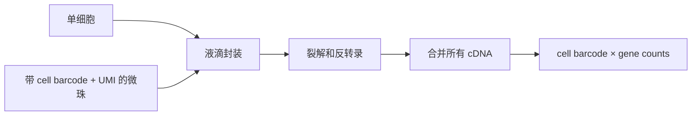

# Highly Parallel Genome-wide Expression Profiling of Individual Cells Using Nanoliter Droplets

> **作者** · Macosko et al., **期刊** · *Cell*, **年份** · 2015, **DOI** · https://doi.org/10.1016/j.cell.2015.05.002  
> **一句话**：Drop-seq 把单细胞 RNA-seq 从低通量“精细测少数细胞”推进到低成本“规模化抽样组织细胞群”。

## 1. 背景与前问

早期 scRNA-seq 已证明单个细胞能测转录组，但成本和操作复杂度限制了规模。板式路线灵敏度高，却难以一次测上万细胞。真正卡住的问题是：组织里细胞类型和状态很多，如果每个实验只能测几十到几百个细胞，就很难发现稀有细胞、连续状态和真实群体结构。

Drop-seq 的前问非常工程化：能不能把单细胞分隔、条形码标记和文库构建并行化，让每个细胞带上自己的 barcode，再把所有细胞混在一起测序？

## 2. 核心问题

核心问题一句话：**如何用足够低的成本和足够高的通量，把组织拆成 cell-by-gene 矩阵？**

这不是单纯提高测序量，而是改变统计单位。bulk RNA-seq 的单位是样本；Drop-seq 的单位是细胞。只要 cell barcode 和 UMI 可靠，组织平均表达就可以被拆成细胞组成、细胞类型和状态分布。

## 3. 实验设计的关键决策

技术上最关键的选择是水滴微流控：把单个细胞、裂解液和带 barcoded oligo-dT 的微珠包进纳升级液滴。这个设计牺牲了全长转录本和部分灵敏度，但换来极高通量和低成本。

作者用人工混合细胞系检验 barcode 是否能区分细胞来源，又用小鼠视网膜做真实组织验证。视网膜是好系统：细胞类型丰富，已有生物学先验，尤其 bipolar cells 亚型适合测试方法能否分辨细粒度细胞类型。

## 4. 数据生成与处理

Drop-seq 的分子逻辑：

cell barcode 标记 RNA 来自哪个细胞；UMI 标记原始 RNA 分子，降低 PCR amplification bias。分析上要先识别真实细胞 barcode，再构建 UMI-collapsed gene counts。之后的 PCA、聚类、marker gene 分析都建立在这个矩阵上。

## 5. 关键 Figure 拆解

### Figure 1：Drop-seq 的分子工程

这张图在统计上做的是定义观测单位。液滴不是装饰，它保证每个细胞 RNA 和某颗 barcode bead 绑定。生物学声明是：单个细胞的 mRNA 可以在 pooled sequencing 中被重新分配回细胞。

强度边界：这个流程不能保证每个液滴一个细胞。doublet、empty droplet、ambient RNA 都是后续算法必须处理的问题。

### Figure 2/3：混合细胞系验证

人工混合实验的逻辑是 positive control：如果方法可靠，人源和鼠源 reads 应主要落在不同 cell barcodes 中。统计上这是检验 barcode collision 和 doublet rate。若大量 barcode 同时含人鼠 reads，说明细胞分隔失败。

这一步支撑的是技术可信度，不是生物学发现。

### Figure 4/5：视网膜细胞类型

视网膜应用展示 Drop-seq 能恢复已知 cell classes，并进一步解析 bipolar cell 亚型。生物学声明是：高通量单细胞矩阵可以从复杂组织中重建细胞类型结构。

关键边界：聚类不自动等于细胞类型。真正支撑命名的是 marker gene、已知视网膜生物学和亚型表达程序的一致性。

## 6. 结论的强度边界

强支持的结论：droplet + barcode + UMI 让大规模单细胞转录组成为现实；Drop-seq 足以识别主要细胞类型和部分亚型；UMI 计数比 read count 更接近原始分子数。

弱一些的结论：某些 cluster 是否代表全新细胞类型。没有空间、蛋白和功能验证时，cluster 更稳妥地叫 transcriptional state 或 putative subtype。

## 7. 如果今天重做

今天会加入更严格的 ambient RNA correction、doublet detection、sample multiplexing、cell hashing 和 donor-level pseudobulk。对植物，还要面对细胞壁解离偏差：Drop-seq 的逻辑能迁移，但 protoplasting 会强烈改变细胞组成和应激表达，因此 snRNA-seq 或空间路线常常更稳。

## 8. 我学到了什么

（Peter 填）

## 横向连接

- [[04-scRNAseq/scrnaseq-platforms]]
- [[04-scRNAseq/umi-pcr-correction]]
- [[04-scRNAseq/doublet-detection]]
- [[04-scRNAseq/pseudoreplication-pseudobulk]]

## 参考

- Macosko et al. (2015), *Cell*, DOI: https://doi.org/10.1016/j.cell.2015.05.002
- Klein et al. (2015), *Cell*, DOI: https://doi.org/10.1016/j.cell.2015.04.044
- Zheng et al. (2017), *Nature Communications*, DOI: https://doi.org/10.1038/ncomms14049
