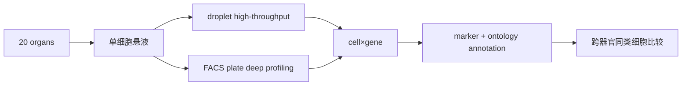

# Single-cell transcriptomics of 20 mouse organs creates a Tabula Muris

> **作者** · Tabula Muris Consortium, **期刊** · *Nature*, **年份** · 2018, **DOI** · https://doi.org/10.1038/s41586-018-0590-4  
> **一句话**：Tabula Muris 用跨器官单细胞图谱证明，细胞类型既有核心身份，也有被组织环境塑造的局部状态。

## 1. 背景与前问

单细胞技术成熟后，领域马上遇到新问题：每篇论文都给出一批 cluster，但缺少跨组织、跨实验可查询的参考坐标。免疫细胞、内皮细胞、成纤维细胞在不同器官是否相同？一个 marker 在不同组织是否可靠？这些问题需要 atlas，而不是单个处理组实验。

## 2. 核心问题

核心问题一句话：**能否为小鼠多个器官建立统一的细胞类型参考，并比较同类细胞在不同组织中的状态差异？**

这是一篇资源型论文，但不是简单“测很多细胞”。它的真正价值是把 cell type 变成跨器官可比的分子对象。

## 3. 实验设计的关键决策

研究覆盖 20 个器官，并使用 droplet 与 FACS/plate-based 两条技术路线。droplet 提供通量，FACS/plate 提供更高基因检出和 index sorting 信息。这个双平台设计能部分区分技术偏差和真实生物差异。

样本设计控制了年龄和性别，并尽量从同一批动物取多个器官。这个取舍降低了个体差异，但也意味着 atlas 主要代表特定年龄和健康状态的小鼠。

## 4. 数据生成与处理

核心数据结构是 cell-by-gene matrix。流程包括 QC、归一化、降维、聚类、marker gene identification、cell ontology 标注和跨器官比较。

统计上，聚类只给 expression similarity；注释需要 marker gene 组合、已知组织学和 cell ontology。

## 5. 关键 Figure 拆解

<figure class="source-figure" markdown="1">
  
  <figcaption><strong>真实结果图 · Figure 1。</strong> 这张图是 Tabula Muris 的 atlas 地图：器官覆盖、两种平台、细胞数和总体细胞类型结构。读图时先看“取样宇宙”有多大，再看 atlas 结论能推广到哪里。来源：Tabula Muris Consortium 2018, <em>Nature</em>, <a href="https://doi.org/10.1038/s41586-018-0590-4">DOI</a>, Creative Commons Attribution 4.0 International License。</figcaption>
</figure>

### Figure 1：全项目设计和细胞图谱

这张图说明样本、器官、平台和总体细胞数。它在统计上定义了 atlas 的覆盖范围。生物学声明是：多个器官中的主要细胞类型可以被系统 catalog。

边界：atlas 覆盖不是无限。脆弱细胞、低丰度细胞和解离困难组织可能被低估。

### Figure 2/3：细胞类型注释

这些图展示 marker genes 和 cluster annotation。支撑细胞命名的不是 UMAP 坐标，而是 marker 组合与已知细胞生物学一致。例如 T cells、B cells、endothelial cells、epithelial cells 都要靠多基因证据。

### Figure 4/5：跨器官比较

这些图的关键是：同一大类细胞在不同器官共享核心身份，但也保留器官特异表达。生物学声明是组织微环境塑造 cell state。

## 6. 结论的强度边界

强支持：健康成年小鼠多器官主要细胞类型可由 scRNA-seq 系统编目；同类细胞存在跨器官状态差异；双平台数据能互补。

边界：atlas 不等于所有细胞类型本体论；单细胞悬液丢失空间和细胞互作；解离诱导应激和细胞损失会影响比例。把 Tabula Muris 直接当任何疾病或发育阶段参考都要谨慎。

## 7. 如果今天重做

今天会加入 snRNA-seq 处理难解离组织，加入空间转录组定位细胞类型，加入 CITE-seq 或空间蛋白校准 marker，并在统计上用 donor-level pseudobulk 重新评估跨器官差异。对植物 atlas，应从根尖、叶片、花器官等空间结构出发，避免只把 protoplast cluster 命名成“细胞类型”。

## 8. 我学到了什么

（Peter 填）

## 横向连接

- [[04-scRNAseq/cell-type-annotation-paradigms]]
- [[04-scRNAseq/pseudoreplication-pseudobulk]]
- [[06-spatial/scrnaseq-spatial-projection]]
- [[05-snRNAseq/snrna-vs-scrna-molecular]]

## 参考

- Tabula Muris Consortium (2018), *Nature*, DOI: https://doi.org/10.1038/s41586-018-0590-4
- Han et al. (2018), *Cell* — Mouse Cell Atlas
- Schaum et al. (2018), *Nature* — tissue ageing single-cell atlas
