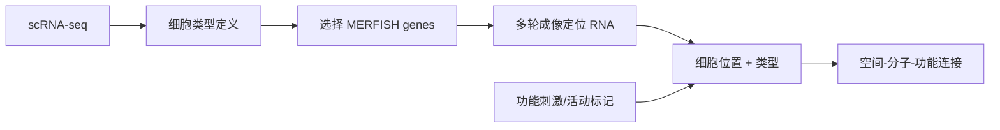

# Molecular, spatial and functional single-cell profiling of the hypothalamic preoptic region

> **作者** · Moffitt et al., **期刊** · *Science*, **年份** · 2018, **DOI** · https://doi.org/10.1126/science.aau5324  
> **一句话**：他们用 scRNA-seq 定义细胞类型，再用 MERFISH 把这些类型放回下丘脑空间和功能语境。

## 1. 背景与前问

下丘脑 preoptic region 参与体温、睡眠、社会行为和内分泌调节，但细胞类型复杂，传统 marker 难以完整描述。scRNA-seq 能发现细胞类型，却丢失位置；空间成像能定位，但需要知道测哪些基因。

## 2. 核心问题

核心问题一句话：**如何把单细胞定义的神经元类型放回真实解剖位置，并连接到功能活动？**

这篇的聪明之处是 scRNA-seq 和 MERFISH 不是平行展示，而是前者定义 cell types，后者做空间和功能定位。

## 3. 实验设计的关键决策

研究先用 scRNA-seq 在 preoptic region 中建立细胞类型 taxonomy，再选择 discriminative genes 设计 MERFISH panel。这样避免盲目成像，也保证 panel 能区分细胞群。

系统选择小鼠下丘脑，因为区域解剖清楚且功能相关行为可诱导。代价是 MERFISH panel 不是全转录组，所有结论都受所选基因集合限制。

## 4. 数据生成与处理

统计上，MERFISH 用多轮编码和纠错读出单分子 RNA。细胞类型 assignment 依赖 panel genes 与 scRNA reference 的匹配。

## 5. 关键 Figure 拆解

真实 Figure 入口 · 原文 Figures

这篇 <em>Science</em> 论文建议打开 <a href="https://www.science.org/doi/10.1126/science.aau5324">原文 Figures</a>，重点看 Figure 1、Figure 2/3 和 Figure 5/6。读图时先确认 scRNA-seq taxonomy 如何定义细胞类型，再看 MERFISH 是否把这些类型放回非随机空间位置，最后看功能刺激或 activity marker 是否只支持“关联”，还是足以提出功能回路假设。

### Figure 1：scRNA-seq taxonomy

这张图定义细胞类型参考。它的统计动作是聚类和 marker identification。生物学声明是 preoptic region 包含多个分子定义的神经元和非神经细胞类型。

### Figure 2/3：MERFISH 空间定位

这些图把细胞类型投回组织。关键声明是不同分子类型在解剖空间中呈现非随机分布。空间分布让 cell type 从“表达相似”升级为“属于特定微环境”。

### Figure 5/6：功能关联

活动标记或行为条件与特定空间细胞群结合，支持某些细胞类型参与特定功能回路。但这是关联证据，不等于因果操控。

## 6. 结论的强度边界

强支持：scRNA-seq 与 MERFISH 联合可把分子细胞类型定位到组织；preoptic region 的细胞类型具有空间组织；空间位置和功能活动可被同一框架分析。

边界：MERFISH panel 限制发现空间；活动 marker 不是直接神经功能因果；细胞分割和 RNA assignment 影响定量。

## 7. 如果今天重做

今天会加入更大基因面板、空间蛋白、projection tracing、optogenetic/chemogenetic perturbation，以及三维连续切片配准。植物空间项目可借鉴这个逻辑：先用 sc/snRNA 定义细胞类型，再用空间技术定位到根尖或叶片结构，最后用胁迫或发育时间序列连接功能。

## 8. 我学到了什么

（Peter 填）

## 横向连接

- [[06-spatial/imaging-vs-sequencing-spatial]]
- [[06-spatial/spatial-cell-communication]]
- [[04-scRNAseq/cell-type-annotation-paradigms]]
- [[06-spatial/plant-spatial-challenges]]

## 参考

- Moffitt et al. (2018), *Science*, DOI: https://doi.org/10.1126/science.aau5324
- Chen et al. (2015), *Science* — MERFISH
- Xia et al. (2019), *PNAS* — seqFISH+
