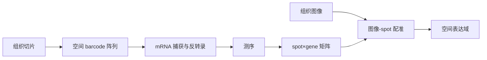

# Visualization and analysis of gene expression in tissue sections by spatial transcriptomics

> **作者** · Ståhl et al., **期刊** · *Science*, **年份** · 2016, **DOI** · https://doi.org/10.1126/science.aaf2403  
> **一句话**：这篇把 RNA-seq 的表达矩阵第一次系统地钉回组织坐标，让“表达在哪里”成为全转录组问题。

## 1. 背景与前问

bulk RNA-seq 保留全转录组，但丢空间；原位杂交保空间，但基因数有限。组织生物学的核心问题常常就是位置：肿瘤边界、脑区、胚胎结构、植物根尖分区。Ståhl 之前，领域缺的是一种能在组织切片上保留坐标、同时接近全转录组读数的方法。

## 2. 核心问题

核心问题一句话：**能否让每个 RNA-seq 表达谱带有组织切片上的空间 barcode？**

如果能做到，表达矩阵就从 sample-by-gene 变成 spot-by-gene，再与 histology 图像共同解释。

## 3. 实验设计的关键决策

作者使用带空间 barcode 的 oligo-dT 阵列捕获组织切片释放的 mRNA。这个设计选择 poly(A) mRNA，优点是与 RNA-seq 兼容；缺点是非 poly(A) RNA 和部分降解样本表现差。

他们用 mouse olfactory bulb 和 breast cancer tissue 展示方法。前者有明确层状结构，适合验证空间表达是否回到已知解剖；后者展示病理组织中表达区域和组织形态如何对齐。

## 4. 数据生成与处理

流程是：

统计上，每个 spot 是观测单位。表达量既受真实细胞组成影响，也受组织厚度、透化效率、mRNA diffusion 和捕获效率影响。

## 5. 关键 Figure 拆解

### Figure 1：技术原理

这张图定义 spatial barcode 逻辑。它的声明是：同一张切片上不同位置捕获的 mRNA 可通过 barcode 回到原始坐标。这个原理决定了后面所有空间分析的可信度。

### Figure 2：嗅球层状表达

mouse olfactory bulb 的已知层状结构是正控。若空间转录组能恢复层特异 marker，说明方法保留真实空间信号。这里统计动作是把 gene expression 投影回 tissue coordinates。

### Figure 4：乳腺癌组织

肿瘤切片展示病理区域与表达域对齐。生物学声明不是“发现某个癌症机制”，而是证明空间表达图谱可以和 histopathology 联合解释。

## 6. 结论的强度边界

强支持：捕获式 spatial transcriptomics 能把表达谱与组织坐标连接；区域特异表达可以与解剖结构和病理区域对应。

边界：spot 不是单细胞，一个 spot 可包含多个细胞；捕获效率和 mRNA diffusion 会模糊边界；空间共定位不是细胞通讯因果。

## 7. 如果今天重做

今天会用更高分辨率平台、配套 scRNA reference 做 deconvolution，并加入空间蛋白或 H&E 病理标注。对植物组织，重点会放在切片质量、细胞壁透化、自发荧光和发育轴配准。根尖这类结构不应只做 domain clustering，还要按分生区、伸长区和成熟区建几何参考。

## 8. 我学到了什么

（Peter 填）

## 横向连接

- [[06-spatial/spot-vs-cell-implications]]
- [[06-spatial/deconvolution-models]]
- [[06-spatial/3d-spatial-reconstruction]]
- [[04-scRNAseq/cell-type-annotation-paradigms]]

## 参考

- Ståhl et al. (2016), *Science*, DOI: https://doi.org/10.1126/science.aaf2403
- Rodriques et al. (2019), *Science* — Slide-seq
- Vickovic et al. (2019), *Nature Methods* — high-definition spatial transcriptomics
