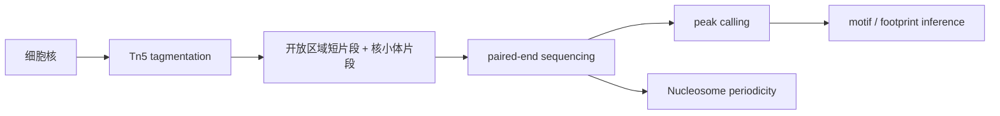

# Transposition of native chromatin for fast and sensitive epigenomic profiling of open chromatin, DNA-binding proteins and nucleosome position

> **作者** · Buenrostro et al., **期刊** · *Nature Methods*, **年份** · 2013, **DOI** · https://doi.org/10.1038/nmeth.2688  
> **一句话**：ATAC-seq 用 Tn5 把开放染色质测量压缩成快速、低输入、可测核小体结构的测序实验。

## 1. 背景与前问

ATAC-seq 出现前，开放染色质主要靠 DNase-seq 和 FAIRE-seq。DNase-seq 分辨率高，但流程复杂、细胞量要求较高；FAIRE-seq 简单但信噪比和机制解释较弱。领域需要一种低输入、快速、能同时读出 open chromatin 和 nucleosome organization 的方法。

## 2. 核心问题

核心问题一句话：**能否利用 Tn5 transposase 对开放染色质的可进入性，同时完成切割和接头插入？**

这个想法改变了实验工程：不再先切割再建库，而是 tagmentation 一步把 chromatin accessibility 转成 sequencing library。

## 3. 实验设计的关键决策

作者选择少量细胞输入，强调速度和灵敏度。这是 ATAC 的最大卖点：它让很多样本类型从“不够细胞做 DNase”变成可测。

他们用 GM12878 等细胞系做验证，因为这些细胞有丰富 ENCODE reference：DNase、ChIP-seq、histone marks。方法学论文必须有 benchmark，否则 peak 只是自说自话。

## 4. 数据生成与处理

ATAC reads 富集区被解释为 accessible chromatin。短片段多来自 nucleosome-free region；约 200 bp 周期片段反映 mono-/di-nucleosome。footprint 则试图从插入缺口推断 TF protection，但会受 Tn5 sequence bias 影响。

## 5. 关键 Figure 拆解

### Figure 1：ATAC 原理和开放区域信号

这张图证明 Tn5 在 native chromatin 中产生可解释信号。统计动作是把 insertion sites 聚合到 TSS、known regulatory elements 和 fragment length distribution。

生物学声明是 ATAC signal 对应开放染色质，并能反映核小体结构。

### Figure 2：与 DNase/FAIRE/ChIP 参考比较

这些 benchmark 是方法学强证据：ATAC peaks 与 DNase hypersensitive sites、active promoter/enhancer marks 重叠。它支持 ATAC 测到的是 regulatory accessible regions，而不是随机切割。

### Figure 3/4：低输入和 TF footprint

低输入展示实用价值；footprint 展示理论潜力。后者要谨慎：ATAC footprint 能提出 TF occupancy 假设，但不等价于 ChIP-seq 直接结合证据。

## 6. 结论的强度边界

强支持：ATAC-seq 是快速、低输入、能检测开放染色质和 nucleosome pattern 的方法；ATAC peaks 与已知 regulatory marks 高度一致。

边界：Tn5 有序列和结构偏好；开放不等于功能；motif/footprint 不等于 TF binding；bulk ATAC 会混合细胞组成。

## 7. 如果今天重做

今天会加入 Tn5 bias correction、spike-in 或严格 QC、paired-end 深度优化、single-cell ATAC 和 multiome。植物 ATAC 要重点处理叶绿体/线粒体 reads、细胞壁核提取偏差和组织类型混合。真正的 enhancer-gene 结论应加入 RNA、Hi-C/ABC、eQTL 或 CRISPR perturbation。

## 8. 我学到了什么

（Peter 填）

## 横向连接

- [[08-ATAC/tn5-cleavage-bias]]
- [[08-ATAC/fragment-size-nucleosome]]
- [[08-ATAC/footprinting-statistics]]
- [[08-ATAC/atac-rna-multimodal]]

## 参考

- Buenrostro et al. (2013), *Nature Methods*, DOI: https://doi.org/10.1038/nmeth.2688
- Thurman et al. (2012), *Nature* — DNase landscape
- Schep et al. (2015), *Genome Research* — chromVAR precursor ideas
