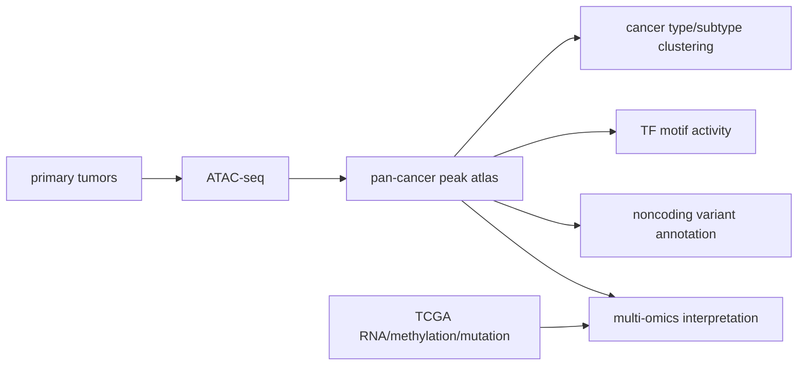

# The chromatin accessibility landscape of primary human cancers

> **作者** · Corces et al., **期刊** · *Science*, **年份** · 2018, **DOI** · https://doi.org/10.1126/science.aav1898  
> **一句话**：他们把 ATAC-seq 扩展到 TCGA 原发肿瘤，展示开放染色质如何连接癌症亚型、TF 程序和非编码风险位点。

## 1. 背景与前问

癌症基因组学已有突变、CNV、表达、甲基化等大量数据，但非编码调控层仍难解释。许多癌症状态不是由一个 coding mutation 直接定义，而是由 lineage TF、enhancer rewiring 和 chromatin state 共同塑造。

## 2. 核心问题

核心问题一句话：**原发肿瘤中的开放染色质图谱能否解释癌症类型、亚型和非编码调控机制？**

这比细胞系 ATAC 更难。原发肿瘤细胞组成复杂、样本质量不一、临床背景异质，但生物学价值也更高。

## 3. 实验设计的关键决策

作者分析 410 个 TCGA 原发肿瘤样本，覆盖 23 种癌症。这个设计的强处是可与 TCGA 多组学和临床信息整合；弱点是 bulk tumor ATAC 混合了肿瘤细胞、免疫细胞和 stromal cells。

他们选择 ATAC 而不是 ChIP-seq，是因为 ATAC 低输入、适合临床样本，并能在 genome-wide 层面读出 candidate regulatory elements。

## 4. 数据生成与处理

统计上，peak matrix 是样本 × regulatory region。分析包括 peak calling、样本聚类、differential accessibility、motif enrichment/deviation 和与表达/甲基化/遗传位点整合。

## 5. 关键 Figure 拆解

### Figure 1：pan-cancer accessibility atlas

这张图展示不同癌症类型的 ATAC profiles。生物学声明是 chromatin accessibility 携带 cancer identity。统计上是高维 peak matrix 的降维和聚类。

### Figure 2/3：亚型和 TF program

差异 peaks 和 motif enrichment 支持 lineage TF 或 oncogenic TF program。读法要谨慎：motif 说明 sequence grammar，不直接证明 TF binding。若 TF 自身表达也高，证据更强。

### Figure 4/5：非编码风险位点和 enhancer-gene 连接

把 GWAS 或 somatic noncoding variants 放到开放元件中，可以优先解释哪些变异落在活跃调控背景。它支持 candidate mechanism，不直接证明 causality。

## 6. 结论的强度边界

强支持：原发肿瘤的 chromatin accessibility 可区分癌症类型和部分亚型；ATAC peaks 可用于注释非编码调控区域；motif 层能提出候选 TF program。

边界：bulk tumor ATAC 会受细胞组成影响；peak-gene link 不唯一；开放区域不一定有 enhancer 功能；临床样本的 cold ischemia 和质量差异会影响 ATAC。

## 7. 如果今天重做

今天会加入 single-cell ATAC/multiome 分解细胞类型，使用 matched tumor-normal 和空间定位，结合 CRISPRi enhancer perturbation 验证 peak-gene 关系。对植物肿瘤或胁迫组织类比研究，最好做 cell-type-resolved ATAC，避免把组织组成变化误读成调控元件开关。

## 8. 我学到了什么

（Peter 填）

## 横向连接

- [[08-ATAC/differential-accessibility]]
- [[08-ATAC/atac-vs-chip-motif]]
- [[15-multiomics-integration/grn-inference-math]]
- [[02-GWAS/regulatory-vs-coding-variation]]

## 参考

- Corces et al. (2018), *Science*, DOI: https://doi.org/10.1126/science.aav1898
- Hoadley et al. (2018), *Cell* — TCGA pan-cancer multi-omics
- Fulco et al. (2019), *Nature Genetics* — ABC enhancer model
