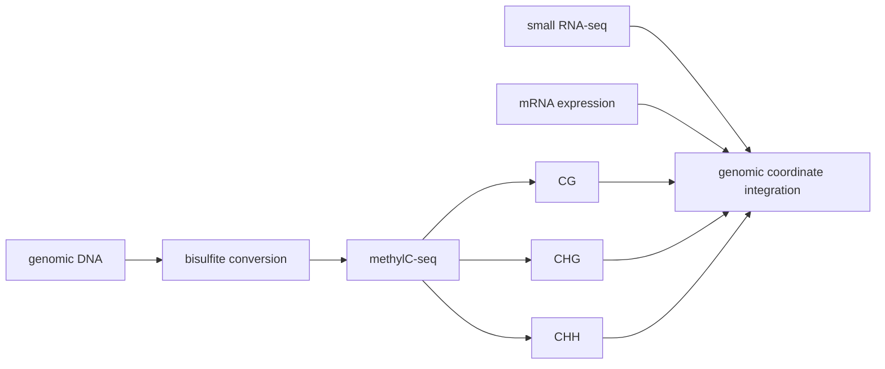

# Highly integrated single-base resolution maps of the epigenome in Arabidopsis

> **作者** · Lister et al., **期刊** · *Cell*, **年份** · 2008, **DOI** · https://doi.org/10.1016/j.cell.2008.03.029  
> **一句话**：这篇把 Arabidopsis 的 DNA 甲基化、小 RNA 和转录输出放到单碱基坐标，定义了植物甲基化组的读法。

## 1. 背景与前问

植物 DNA methylation 与动物不同：不仅有 CG，还有 CHG 和 CHH。植物还有 RdDM 通路，24nt siRNA 能引导 de novo methylation。早期方法能看局部位点或低分辨率区域，但无法系统回答三种 context 在全基因组如何分布、与小 RNA 和表达如何耦合。

## 2. 核心问题

核心问题一句话：**Arabidopsis 基因组中每个胞嘧啶的甲基化状态如何与 small RNA、基因表达和转座子沉默相互关联？**

这不是单独 methylation map，而是 integrated epigenome。

## 3. 实验设计的关键决策

选择 Arabidopsis 是因为参考基因组好、表观遗传突变体和 RdDM 生物学基础强。单碱基分辨率 methylC-seq 是关键：植物三种 context 的解释不同，如果只做区域平均，会把机制混在一起。

整合 small RNA 和 mRNA 是核心取舍。没有 small RNA，你只能说某区域甲基化；有 small RNA，才能追问 RdDM 是否参与。

## 4. 数据生成与处理

Bisulfite 将未甲基化 C 转为 U，测序后读成 T；5mC 相对保留为 C。每个位点 methylation level 近似为：

$$
\hat p=\frac{m}{m+u}
$$

其中 $m$ 是保留 C 的 reads，$u$ 是转化后的 reads。统计解释要考虑 coverage 和转化效率。

## 5. 关键 Figure 拆解

真实 Figure 入口 · 原文 Figures

这篇 <em>Cell</em> 植物 methylome 论文建议打开 <a href="https://www.cell.com/cell/fulltext/S0092-8674(08)00346-2">原文页面</a> 的 Figure 1、Figure 2/3 和 Figure 4/5。读图时一定按 CG、CHG、CHH 分开看：Figure 1 看三种 context 在 gene、TE、repeat 上的分布；Figure 2/3 看 24nt siRNA 与 CHH/RdDM 的空间共定位；Figure 4/5 再把 methylation 和表达/转座子沉默连接起来。

### Figure 1：全基因组 methylation landscape

这张图展示 CG/CHG/CHH 在基因、转座子和重复区域的分布。生物学声明是植物 methylome 具有 context-specific architecture。

### Figure 2/3：small RNA 与 CHH/RdDM

这些图把 24nt siRNA 与 methylation 对齐。若 CHH methylation 与 24nt siRNA 共定位，支持 RdDM 参与。注意这是通路证据，不是单个位点因果证明。

### Figure 4/5：表达和转座子沉默

把 methylation 与 mRNA 输出整合，支持重复序列和转座子甲基化与沉默相关。但基因体甲基化和 promoter methylation 的含义不同，不能简单套“甲基化=沉默”。

## 6. 结论的强度边界

强支持：Arabidopsis methylome 必须按 CG/CHG/CHH 分 context 解读；转座子和重复序列是甲基化重点区域；small RNA 与部分非 CG methylation 紧密相关。

边界：相关不等于因果；bisulfite damage 和 mapping bias 会影响重复区域；区域 methylation 与邻近基因表达之间需要方向性验证。

## 7. 如果今天重做

今天会加入 nanopore direct methylation、mutant series（met1/cmt3/drm2/pol iv/pol v）、单细胞或空间甲基化，并用 targeted demethylation/methylation 验证 DMR 功能。植物项目里必须把 methylation context、small RNA 和 TE annotation 一起读，否则很容易把 RdDM 与 maintenance methylation 混淆。

## 8. 我学到了什么

（Peter 填）

## 横向连接

- [[09-methylation/plant-three-contexts]]
- [[09-methylation/rddm-integration]]
- [[09-methylation/beta-binomial-for-methylation]]
- [[14-microbiome/rhizosphere-stratification]]

## 参考

- Lister et al. (2008), *Cell*, DOI: https://doi.org/10.1016/j.cell.2008.03.029
- Cokus et al. (2008), *Nature* — Arabidopsis methylome
- Matzke & Mosher (2014), *Nature Reviews Genetics* — RdDM review
