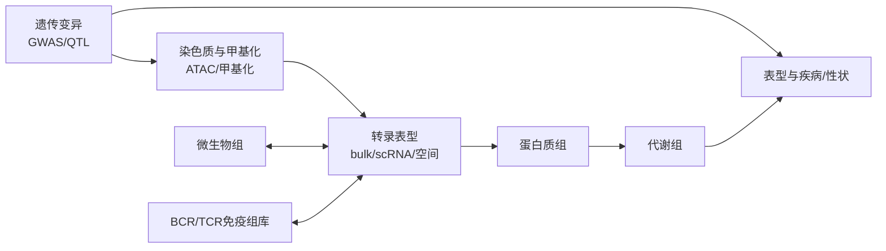

# 前言

这本书的目标不是把所有组学工具罗列一遍，而是帮助你建立一种稳定的判断能力：看到一个生物学问题时，知道应该测什么、为什么这么测、数据大概长什么样、分析时最容易在哪里犯错。

建议阅读顺序：

1. 先读 Part 1，建立组学研究的共同框架。
2. 再读 Part 2，理解转录、单细胞、空间、染色质和甲基化这些分子表型组学。
3. 然后读 Part 3 和 Part 4，把免疫组库、微生物组、GWAS 和 QTL 放进遗传与生态背景。
4. 最后读 Part 5，学习蛋白质组、代谢组和多组学整合。

## 学习这本书要抓住的主线

- **组学不是一个技术名词，而是一种测量视角。** 不同组学看到的是同一个系统的不同投影。
- **每一种组学都有盲区。** RNA 不等于蛋白，细胞类型不等于细胞状态，相关位点不等于因果基因。
- **实验设计往往比分析软件更重要。** 批次、样本量、随机化、混杂因素和验证策略决定结论上限。
- **多组学整合不是把图放在一起。** 真正的整合要说明不同数据层之间的方向、时间顺序和机制约束。
- **高水平论文的价值在问题设计。** 读 CNS 案例时，重点不是记住用了什么软件，而是看作者为什么必须测这一层、关键结果如何排除替代解释、哪些结论仍需要功能验证。

## 全书地图

<!-- deploy-trigger: 2026-05-03 -->
