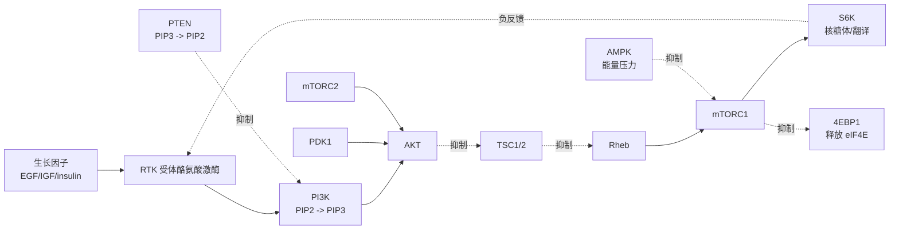

# PI3K-AKT-mTOR 通路为什么是肿瘤里最常被问的生长通路之一？

> 它把生长因子、营养、代谢、存活和治疗耐药接到同一个细胞决策轴上。

## 先把词听懂

- PI3K（phosphoinositide 3-kinase）：把膜脂 PIP2 磷酸化成 PIP3 的激酶，是通路入口之一。
- PIK3CA：编码 PI3K catalytic subunit p110α 的基因，乳腺癌等肿瘤中常见激活突变。
- AKT（protein kinase B）：PIP3 招募后被 PDK1 和 mTORC2 激活，促进生长、代谢和存活。
- PTEN：把 PIP3 去磷酸化回 PIP2 的肿瘤抑制因子，是 PI3K 的刹车。
- mTORC1 / mTORC2：mTOR 形成的两个复合物；mTORC1 调蛋白合成和代谢，mTORC2 参与 AKT 完全激活和细胞骨架。
- TSC1/TSC2：抑制 Rheb 的复合物，是 AKT 到 mTORC1 之间的关键闸门。
- 4EBP1 / S6K：mTORC1 下游，控制翻译起始和核糖体相关蛋白合成。

## 长答案

正常细胞不会因为外面有一点营养就无限生长。它要同时确认三件事：外界是否有生长因子、细胞内能量是否足够、是否需要进入合成状态。PI3K-AKT-mTOR 正是整合这些信号的主轴之一。

最简化的流程是：

<figure class="source-figure" markdown="1">

<figcaption><strong>真实通路图。</strong>MTOR-pathway-v1.7.svg，Charles Betz，CC BY 3.0，Wikimedia Commons。它是 2009 年版本，适合看主干和反馈，不应当作 2026 年完整临床药物图谱。来源：<a href="https://commons.wikimedia.org/wiki/File:MTOR-pathway-v1.7.svg">Wikimedia Commons</a>，访问日期 2026-05-04。</figcaption>
</figure>

在肿瘤里，这条通路常被三类方式劫持：

1. 上游一直踩油门：RTK 扩增或过度激活，例如 HER2、EGFR、IGF1R 信号。
2. 通路内部获得激活突变：PIK3CA 突变、AKT1 E17K 等。
3. 刹车失灵：PTEN 丢失、TSC1/2 失活。

结果是细胞更容易合成蛋白、摄取营养、抵抗凋亡，并在激素治疗、HER2 治疗或化疗压力下找到旁路生存方式。

## 为什么这么设计 / 为什么临床会这样问

临床医生问 PI3K/AKT/mTOR，通常不是想听通路百科，而是想知道三件事：

- 这个病人的肿瘤是否真的依赖这条通路？
- 有没有可用药物或临床试验？
- 如果耐药，是上游绕开、下游补偿，还是旁路通路接管？

截至 2026-05-04，和这条轴相关、乳腺癌中常被讨论的药物包括：

| 药物 | 主要位点 | 典型临床语境 |
|---|---|---|
| alpelisib | PI3Kα | HR+/HER2-、PIK3CA 突变晚期乳腺癌，联合 fulvestrant |
| inavolisib | PI3Kα | PIK3CA 突变、内分泌耐药 HR+/HER2- 晚期乳腺癌，联合 palbociclib + fulvestrant |
| capivasertib | AKT1/2/3 | HR+/HER2- 且 PIK3CA/AKT1/PTEN 改变，联合 fulvestrant |
| everolimus | mTORC1 | HR+/HER2- 晚期乳腺癌等，常与内分泌治疗联用 |

药物列表会随适应症和指南更新变化，所以临床笔记必须标注日期，不把药物状态写成永恒事实。

## 组学翻译

PI3K-AKT-mTOR 相关课题不能只看“通路富集”。更有力的证据链是：

- WES/靶向 panel：PIK3CA、AKT1、PTEN、TSC1/2 等突变或拷贝数改变。
- RNA-seq/scRNA-seq：下游代谢、翻译、细胞周期和抗凋亡程序是否激活。
- 蛋白/磷酸化蛋白组：p-AKT、p-S6、p-4EBP1 等是否真正被激活。
- spatial：激活是否集中在侵袭前沿、缺氧区、免疫排斥区或治疗残留区。
- 纵向样本：治疗前是否已有激活，治疗后是否选择出高 AKT/mTOR 状态。

如果医生说“我们看到 PI3K 通路上调”，Peter 要追问：这是基因突变、mRNA signature、蛋白磷酸化，还是富集分析？四者证据等级不同。

## 🌱 与植物的对照

可迁移的是“营养/能量状态与生长决策耦合”的大逻辑。植物也有 TOR 参与营养、光合碳源和生长控制，SnRK1 与动物 AMPK 在能量压力感知上有类比。

不能直接迁移的是 RTK-PI3K-AKT 这一套上游结构。植物没有与哺乳动物完全对应的 AKT 癌症轴，也没有“肿瘤细胞在组织内克隆扩张并被靶向药选择”的临床语境。植物里谈 TOR 更多是发育和环境适应，人类肿瘤里谈 PI3K-AKT-mTOR 则直接连到驱动突变、药物和耐药。

## ⚠️ 容易混淆 / 常见误解

**误解 1：mTOR 激活就说明 PI3K 一定突变。**  
错。营养、AMPK、RAS/MAPK、缺氧、氨基酸感知都能影响 mTORC1。

**误解 2：RNA-seq 通路上调等于药物靶点激活。**  
不够。PI3K/AKT/mTOR 是强磷酸化调控通路，蛋白和 phosphoproteomics 证据更接近功能状态。

**误解 3：打一个节点就能长期关掉通路。**  
常常不行。S6K 负反馈解除、RTK 反弹、RAS/MAPK 并行通路和 ER 信号交叉都可造成耐药。

## 横向连接

- [[medical-bridge/L1-clinical-literacy/oncology-endpoints-os-pfs-orr-dor]]
- [[medical-bridge/L4-disease-omics-crossovers/tumor/tumor-scrnaseq-playbook]]
- [[03-bulk-RNAseq/00-chapter]]
- [[part5-多组学整合/ch13-蛋白质组与代谢组]]

## 我现在的理解状态

`#待 Peter 确认`

## 参考

- Cantley (2002), *Science* — The phosphoinositide 3-kinase pathway.
- Samuels et al. (2004), *Science* — High frequency of PIK3CA mutations in human cancers.
- Fruman et al. (2017), *Cell* — The PI3K pathway in human disease.
- FDA, inavolisib approval notification, accessed 2026-05-04: https://www.fda.gov/drugs/resources-information-approved-drugs/fda-approves-inavolisib-palbociclib-and-fulvestrant-endocrine-resistant-pik3ca-mutated-hr-positive
- NCI, Drugs Approved for Breast Cancer, accessed 2026-05-04: https://www.cancer.gov/about-cancer/treatment/drugs/breast
