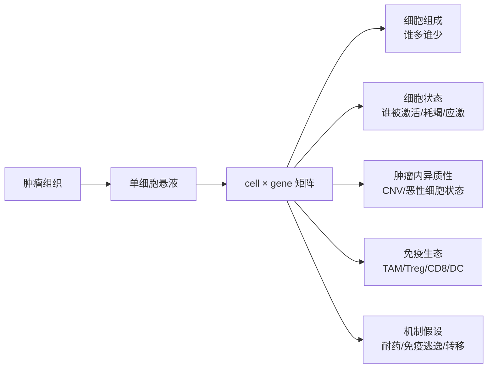

# 肿瘤 × scRNA-seq 一般是为了解决什么问题？

> scRNA-seq 的核心价值是把“肿瘤样本平均值”拆成细胞组成、细胞状态和细胞间生态。

## 先把词听懂

- 单细胞 RNA 测序（single-cell RNA sequencing, scRNA-seq）：对单个细胞测 mRNA，得到 cell × gene 矩阵。
- 肿瘤微环境（tumor microenvironment, TME）：肿瘤细胞之外的免疫、间质、血管和基质成分。
- 肿瘤免疫微环境（tumor immune microenvironment, TIME）：TME 中与免疫细胞和免疫抑制相关的部分。
- 肿瘤异质性（tumor heterogeneity）：不同肿瘤细胞克隆或状态之间的差异。
- 耐药细胞状态（drug-tolerant state）：治疗压力下暂时存活、可进一步演化成稳定耐药的细胞状态。

## 长答案

肿瘤 bulk RNA-seq 的一个根本限制是“平均”。一个样本里同时有肿瘤细胞、T 细胞、巨噬细胞、成纤维细胞、内皮细胞，bulk 看到的上调可能来自细胞组成变化，也可能来自每个细胞内表达增强。

scRNA-seq 把问题拆开：

肿瘤 scRNA-seq 常回答四类问题：

1. TIME 解析：哪些免疫细胞在场，它们是激活、耗竭还是抑制。
2. 肿瘤异质性：恶性细胞里是否有不同状态或亚克隆。
3. 治疗前后耐药机制：治疗压力是否选择出某些细胞状态。
4. 罕见亚群发现：少量干性、EMT、药物耐受或抗原呈递缺陷细胞。

## 为什么这么设计 / 为什么临床会这样问

医生问“为什么这个病人不响应免疫治疗”，可能有三种完全不同的生物学答案：

- 没有足够 T 细胞进入肿瘤：immune excluded / desert。
- T 细胞在场但功能耗竭：PDCD1、LAG3、TIGIT 等抑制轴。
- 肿瘤细胞本身不可见：抗原呈递缺陷、HLA 丢失、IFN 通路异常。

scRNA-seq 的优势是能把这些细胞状态分开。但它不能告诉你空间接触关系，也很难直接证明细胞通讯因果。因此医生如果关心“CD8 T 是否接触肿瘤细胞、TLS 是否靠近响应区域”，spatial 往往要加入。

## 取样策略

| 临床问题 | 推荐取样 | 关键注意 |
|---|---|---|
| 原发耐药 | 治疗前 biopsy，响应者 vs 不响应者 | 分期、治疗线数、驱动突变要匹配 |
| 获得性耐药 | baseline + progression 配对 | 进展定义要清楚，最好配 ctDNA/WES |
| 新辅助治疗反应 | 治疗前 + 手术残留 | 手术样本受治疗影响，细胞死亡和应激多 |
| TIME 描述 | 新鲜组织优先 | 消化偏倚会丢失脆弱细胞和空间信息 |
| 罕见亚群 | 多样本、足够细胞量 | 批次和 doublet 会制造假罕见群 |

## 分析特殊性

肿瘤 scRNA-seq 不是普通组织 atlas。至少要处理：

- 恶性细胞识别：常用 inferred CNV、已知 marker、突变信息联合判断。
- 样本层 pseudobulk：避免把细胞数当生物重复。
- dissociation stress：组织消化引起 FOS/JUN/HSP 等应激表达。
- doublet：肿瘤细胞和免疫细胞 doublet 会伪造“细胞通讯”。
- patient effect：病人差异常大于细胞状态差异。

## 常见陷阱

**陷阱 1：把 cluster 自动命名成新细胞类型。**  
肿瘤中很多 cluster 只是状态、细胞周期、应激或样本来源。

**陷阱 2：用细胞数当样本量。**  
10 个病人每人 5000 个细胞，生物重复仍然主要是 10，不是 50000。

**陷阱 3：只做 ligand-receptor 图就讲通讯机制。**  
配体受体共表达只是线索，需要空间邻近、扰动实验或蛋白验证支撑。

## 客户对话切入

医生说这些话时，可以考虑肿瘤 scRNA-seq：

- “我们想知道免疫治疗不响应是 T 细胞问题还是肿瘤细胞问题。”
- “治疗后残留病灶里到底剩了什么细胞。”
- “这个癌种病理很异质，bulk 看不清。”
- “我们怀疑有一小群耐药细胞。”

医生说这些话时，要主动提醒 spatial 或 WES/WGS：

- “我们关心肿瘤边界和免疫细胞接触。”
- “我们想看克隆演化和驱动突变。”
- “样本只有 FFPE，没有新鲜组织。”

## 里程碑论文入口

- Tirosh et al. (2016), *Science* — 黑色素瘤单细胞揭示恶性细胞状态和 TME 异质性。
- Azizi et al. (2018), *Cell* — 乳腺癌免疫微环境单细胞图谱。
- Maynard et al. (2020), *Cell* — 肺癌靶向治疗残留和耐药相关状态。

后续应按文献深读模板逐篇拆 Figure，尤其是恶性细胞识别、细胞状态命名和治疗前后比较。

## 横向连接

- [[medical-bridge/L1-clinical-literacy/pico-clinical-question]]
- [[medical-bridge/L1-clinical-literacy/recist-irecist-response]]
- [[medical-bridge/L2-human-molecular-cell-biology/_pathways/pi3k-akt-mtor-core-map]]
- [[04-scRNAseq/_papers/macosko-2015-cell-dropseq]]
- [[06-spatial/_papers/stahl-2016-science-spatial-transcriptomics]]

## 我现在的理解状态

`#待 Peter 确认`

## 参考

- Tirosh et al. (2016), *Science*.
- Azizi et al. (2018), *Cell*.
- Maynard et al. (2020), *Cell*.
- Macosko et al. (2015), *Cell*.
- Zheng et al. (2017), *Nature Communications*.
