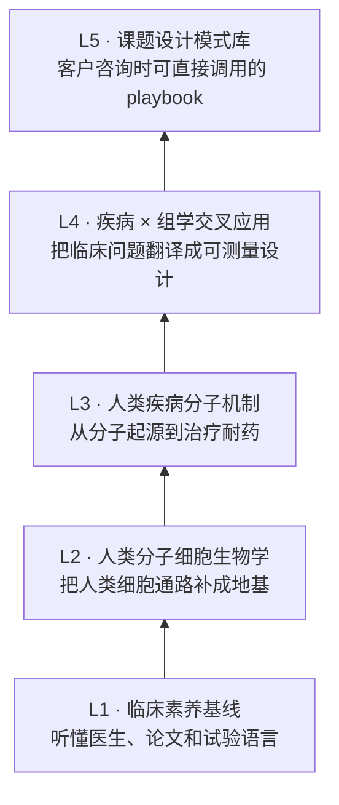

# Peter 的医学转化能力学习蓝图

> 最终目标：让一个没有医学训练、但有组学和生信工程经验的植物生物学 PI，逐步具备和临床医生共同定义问题、读懂疾病机制、设计组学课题、解释临床意义的能力。

这套 vault 采用五层结构：

## 为什么先写 L1/L2

Peter 已经有组学方法学基础，但医学转化项目最大的风险通常不是“不会跑流程”，而是：

- 听不懂临床问题的真实边界。
- 把癌种、分期、治疗线数、取样时点这些关键变量当成背景噪音。
- 会解释差异基因，却不知道这个机制在疾病和治疗中是否站得住。
- 医生说“耐药”，生信侧没有立刻追问“原发耐药还是获得性耐药、按哪个标准定义、样本取自哪个时间点”。

所以本库从 `L1-clinical-literacy/` 和 `L2-human-molecular-cell-biology/` 启动。后续每篇 L4/L5 课题设计笔记，都必须能回链到 L1 的临床语言、L2/L3 的生物机制，以及本书前半部分的组学方法。

## 当前入口

- [[medical-bridge/L1-clinical-literacy/00-MOC]]
- [[medical-bridge/L2-human-molecular-cell-biology/00-MOC]]
- [[medical-bridge/L3-disease-mechanisms/00-MOC]]
- [[medical-bridge/L4-disease-omics-crossovers/00-MOC]]
- [[medical-bridge/L5-study-design-playbook/00-MOC]]
- [[medical-bridge/_capstones/00-capstone-map]]
