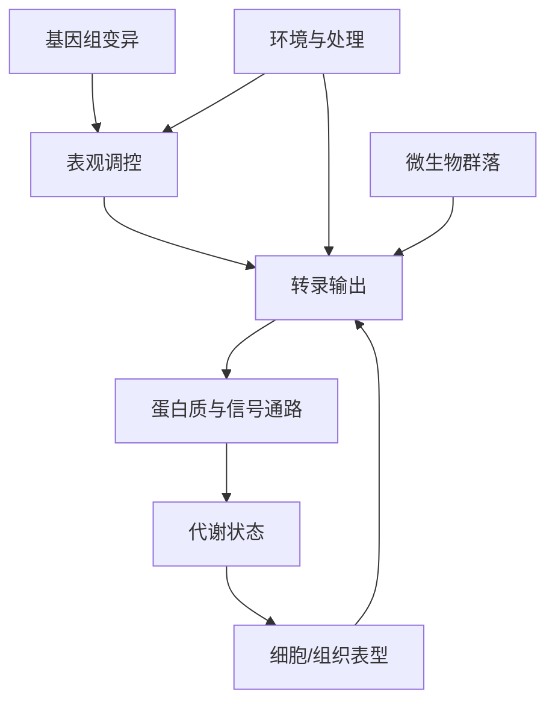

<a href="../../index.md">首页</a>›<a href="#">Part 1 入门框架</a>›第 1 章

<header class="chapter-header">

  
01

  
Part 1 · 入门框架

  <h1 class="chapter-title">组学全景与问题意识</h1>
  
先建立地图，再进入每一种组学的技术细节。

</header>

<nav class="chapter-toc"><h3>本章目录</h3><ol>
  <li>组学到底在测什么</li>
  <li>从 DNA 到表型的多层系统</li>
  <li>组学研究能回答的六类问题</li>
  <li>相关、因果与机制的边界</li>
  <li>学习组学的主线</li>
</ol></nav>

组学的诱惑在于“全局”：一次实验似乎能同时测到成千上万个基因、位点、细胞、微生物或代谢物。组学的困难也在于“全局”：变量太多、噪音太多、混杂因素太多，数据很容易给人一种已经理解系统的错觉。本章先建立一张概念地图，帮助你判断不同组学分别处在生命系统的哪一层。

## 1.1组学到底在测什么

“组学”不是某一个固定技术，而是一类高通量测量方法。它通常有三个共同特征：第一，测量对象很多，例如全基因组变异、全转录本表达、全染色质可及区域或微生物群落组成；第二，单个变量的解释力有限，需要从模式、网络和统计关联中读出信息；第三，数据分析不是实验之后的附属步骤，而是实验设计的一部分。

可以把组学理解为不同层级的“投影”。GWAS 看的是遗传变异和表型之间的统计联系；ATAC-seq 看的是染色质哪些区域更容易被调控因子接触；RNA-seq 看的是转录输出；蛋白质组和代谢组更接近功能执行层；微生物组描述宿主外部或内部生态系统；单细胞和空间组学则把“平均信号”拆回细胞和组织结构。

| 组学 | 主要测量对象 | 最常见输出 | 典型问题 |
|---|---|---|---|
| GWAS | 群体遗传变异 | SNP-性状关联 | 哪些遗传区域影响性状 |
| RNA-seq | RNA 丰度 | 基因表达矩阵 | 哪些通路被激活或抑制 |
| 单细胞转录组 | 每个细胞的 RNA | 细胞 × 基因矩阵 | 有哪些细胞类型和状态 |
| 空间转录组 | 组织位置上的 RNA | spot/细胞 × 基因 × 坐标 | 分子变化发生在哪里 |
| ATAC-seq | 开放染色质 | peaks 和可及性矩阵 | 哪些调控元件处于开放状态 |
| DNA 甲基化 | 胞嘧啶甲基化 | CpG/区域甲基化比例 | 表观调控是否改变 |
| BCR/TCR | 免疫受体序列 | 克隆型和 CDR3 | 免疫克隆是否扩增 |
| 微生物组 | 微生物分类或基因功能 | taxa/功能丰度表 | 群落结构和功能如何变化 |

认知升级

不要把“组学”理解成“测得越多越好”。一个好的组学实验，是用足够宽的测量范围回答一个清楚的问题；一个差的组学实验，是在问题不清楚时寄希望于数据自己给答案。

## 1.2从 DNA 到表型的多层系统

生命系统的一个核心事实是：信息并不是从 DNA 单向、线性地流向表型。遗传变异影响调控元件，调控元件影响转录，转录影响蛋白，蛋白改变代谢和细胞行为，但环境、微生物、细胞互作和疾病状态也会反过来改变转录与表观层。

因此，组学解释必须区分“层级”。例如某个疾病样本里一个炎症基因高表达，这可能来自更多免疫细胞浸润，也可能来自同一种细胞进入激活状态；可能是疾病原因，也可能是疾病后果。单靠 bulk RNA-seq 很难区分这些可能性，但结合单细胞、空间、遗传变异或实验扰动后，解释会更接近机制。

## 1.3组学研究能回答的六类问题

第一类是**差异问题**：处理组和对照组有什么不同？差异表达、差异可及性、差异甲基化、差异丰度都属于这一类。

第二类是**组成问题**：系统由哪些成分构成？单细胞中的细胞类型组成、微生物组中的菌群组成、免疫组库中的克隆组成都属于这一类。

第三类是**状态问题**：同一类细胞或样本处在什么功能状态？例如 T 细胞耗竭、巨噬细胞炎症激活、肿瘤细胞上皮-间质转化。

第四类是**调控问题**：哪些转录因子、调控元件、甲基化区域或遗传变异可能驱动表达变化。

第五类是**轨迹问题**：系统是否存在时间、发育或分化方向。单细胞拟时序、谱系追踪、纵向组学都围绕这个问题展开。

第六类是**关联与预测问题**：某些组学特征能否解释疾病风险、药物反应、产量、抗性或生存时间。

## 1.4相关、因果与机制的边界

组学最常产生的是相关证据。差异表达说明“在这个比较中表达不同”，不自动说明该基因导致了表型；GWAS 位点说明“附近遗传变异与表型共分离”，不自动说明最近的基因就是因果基因；微生物丰度变化说明“群落结构伴随表型改变”，不自动说明某个菌导致疾病。

要从相关走向因果，通常需要加入额外证据：遗传扰动、药物干预、时间顺序、剂量反应、独立队列复现、功能实验、细胞类型定位、空间共定位或机制模型。组学的价值在于提出高质量假设，缩小候选范围，而不是替代因果验证。

关键问题

读任何组学论文时都可以问三句话：比较对象是否合理？主要信号是否可能由组成差异或批次驱动？作者有没有用独立证据支持因果解释？

## 1.5学习组学的主线

学习每一种组学时，建议固定使用同一套问题：

1. 这项技术测量的物理对象是什么？
2. 原始数据怎样变成矩阵？
3. 矩阵中的零、缺失值和噪音来自哪里？
4. 归一化的目的是什么？
5. 差异分析的统计单位是什么？
6. 哪些结论需要独立验证？

当你能用这六个问题讲清楚一门组学时，说明你已经从“会跑流程”进入了“知道流程在假设什么”的阶段。

