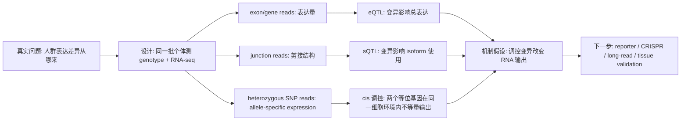

<a href="../../index.md">首页</a>›<a href="#">Part 2 分子表型组学</a>›第 4 章

<header class="chapter-header">

  
04

  
Part 2 · 分子表型组学

  <h1 class="chapter-title">转录组 RNA-seq</h1>
  
从表达矩阵理解细胞和组织的转录状态。

</header>

<nav class="chapter-toc"><h3>本章目录</h3><ol>
  <li>RNA-seq 测量的对象</li>
  <li>建库策略与数据结构</li>
  <li>差异表达分析</li>
  <li>通路与网络解释</li>
  <li>常见误区</li>
  <li>CNS / 高影响案例深读：RNA-seq 如何读出表达变异机制</li>
</ol></nav>

## 4.1RNA-seq 测量的对象

RNA-seq 测量的是 RNA 分子的相对丰度。它可以回答“某条件下哪些基因表达更高或更低”，也可以分析可变剪接、融合转录本、等位基因特异表达和非编码 RNA。但 RNA-seq 不能直接告诉我们蛋白水平、蛋白活性或代谢通量。

bulk RNA-seq 的样本通常是组织、细胞群或培养物。它的优势是稳健、成本相对可控、统计模型成熟；弱点是会把不同细胞类型的表达混合在一起。一个基因在肿瘤组织中升高，可能因为肿瘤细胞表达升高，也可能因为免疫细胞比例增加。

## 4.2建库策略与数据结构

常见建库策略有 poly(A) 富集和 rRNA 去除。poly(A) 富集适合成熟 mRNA，成本低、背景少，但不适合降解样本和许多非 poly(A) RNA。rRNA 去除覆盖面更广，适合 FFPE、细菌、病毒或长非编码 RNA，但背景和成本可能更高。

定量层面可以使用 gene-level counts、transcript-level abundance 或 splice junction counts。差异表达通常使用 raw counts 输入统计模型，再由模型处理 library size 和离散度；TPM/FPKM 适合样本内表达结构展示，但不应直接作为差异分析输入。

| 指标 | 适合用途 | 注意点 |
|---|---|---|
| raw counts | 差异表达模型 | 需要归一化和离散度估计 |
| TPM | 比较同一样本内基因贡献 | 不适合直接跨样本做统计检验 |
| normalized counts | 可视化和聚类 | 取决于归一化方法 |
| junction counts | 剪接分析 | 需要足够 read depth |

## 4.3差异表达分析

差异表达分析的核心不是简单比较均值，而是在计数数据的噪音结构下估计组间差异。RNA-seq counts 通常用负二项分布建模，因为生物重复之间的变异大于泊松抽样噪音。常用思想包括 library size normalization、离散度估计、广义线性模型和多重检验校正。

一个标准差异分析结果至少包含 log2 fold change、统计量、p 值和 adjusted p 值。log2 fold change 表示效应大小，adjusted p 值控制多重检验下的假阳性。解释时不能只看显著性，也要看表达量、效应大小、方向是否符合生物学预期。

## 4.4通路与网络解释

单个基因差异常常不稳定，通路层面的解释更接近生物过程。富集分析通常分为两类：一类先选出差异基因，再问这些基因是否富集于某些 GO、KEGG、Reactome 或 Hallmark gene sets；另一类使用全基因排序，例如 GSEA，避免人为阈值造成信息损失。

通路解释要警惕数据库偏倚。热门通路注释更完整，更容易被富集；一个基因可以属于多个通路，导致结果看起来丰富但并不独立。好的解释应当回到具体基因、细胞类型和实验背景，而不是停留在“炎症通路显著”这种宽泛表述。

## 4.5常见误区

第一，差异表达不等于调控因果。转录因子表达升高，不代表它驱动了全部下游变化。第二，RNA 水平不等于蛋白水平。翻译效率、蛋白降解和修饰都可能改变最终功能。第三，bulk RNA-seq 的差异可能由细胞组成变化驱动。第四，批次校正不能修复完全混杂的设计。

认知升级

RNA-seq 最适合做“状态扫描”和“假设生成”。如果要证明某基因是驱动因子，通常还需要扰动实验、蛋白或功能验证。

## 4.6CNS / 高影响案例深读：RNA-seq 如何读出表达变异机制

**我选的案例。** Pickrell et al. 2010, *Nature*，题目是 *Understanding mechanisms underlying human gene expression variation with RNA sequencing*。这篇比单纯“RNA-seq 能测表达”的方法论文更适合放在这里：它展示 RNA-seq 为什么能同时回答 expression level、splicing、allele-specific expression 三类问题。

**科研逻辑图。**

**为什么必须做 RNA-seq。** 这篇论文之前，eQTL 主要依赖 microarray。array 可以比较探针强度，但对未注释转录本、外显子使用、等位基因特异表达和剪接位点附近变异的分辨率有限。Pickrell 等人测了 69 个 HapMap 尼日利亚个体的 lymphoblastoid cell lines，把 RNA reads 与已知基因型放在一起问：自然人群中的表达差异，到底是 gene-level abundance 变了，还是 transcript structure 和 allele-specific output 变了？

**原理如何支撑结论。** RNA-seq 的核心不是“把 RNA 变成 reads”这么简单，而是 reads 带有基因组坐标。落在 exon 上的 reads 支持表达量，跨 splice junction 的 reads 支持剪接结构，覆盖 heterozygous SNP 的 reads 支持 allele-specific expression。于是同一套数据能把 eQTL 拆成三种机制证据：总表达差异、isoform usage 差异和 cis 调控导致的等位基因偏倚。

**从实际科研逻辑怎么读。** 如果你在自己的材料里看到两个品种或处理组表达不同，第一反应不该是“做富集”。要先拆变量：差异来自启动子/增强子调控、RNA processing、细胞组成，还是 RNA 稳定性？Pickrell 的设计强在同一个个体同时有 genotype 和 RNA，因此能把“表达差异”拉回遗传解释。ASE 尤其有力，因为两个等位基因处在同一个 nucleus、同一批 trans factors 里；如果一个 allele consistently 更高，cis 调控的证据比跨个体表达相关更强。

**关键结果如何支撑生物学声明。** gene-level eQTL 说明变异和表达量相关；junction 或 exon usage 信号说明变异可能改变剪接；ASE 说明同一细胞环境内两个 haplotype 的 RNA 输出不等。三者合在一起，论文的声明不是“我们发现很多差异表达基因”，而是“人群表达变异可以被分解成若干可测的分子机制”。这就是 RNA-seq 相对 array 的范式升级：它读的不是一个探针强度，而是转录本在基因组上的结构化证据。

**结论边界。** 它用的是 LCL 细胞系，不代表所有组织；样本量对 trans-eQTL 和小效应剪接事件有限；短读长对复杂 isoform 的解析仍不完整。今天重做会加入 long-read RNA-seq、single-cell eQTL、nascent RNA 和 ATAC/Hi-C 共定位，进一步区分 promoter、enhancer 和 RNA processing 层的因果贡献。

**参考。** Pickrell et al. 2010. *Nature*. https://www.nature.com/articles/nature08872；ENCODE Project Consortium. 2012. *Nature*. https://www.nature.com/articles/nature11247

