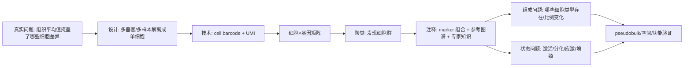

<a href="../../index.md">首页</a>›<a href="#">Part 2 分子表型组学</a>›第 5 章

<header class="chapter-header">

  
05

  
Part 2 · 分子表型组学

  <h1 class="chapter-title">单细胞转录组</h1>
  
把组织平均表达拆解为细胞类型、细胞状态和细胞连续谱。

</header>

<nav class="chapter-toc"><h3>本章目录</h3><ol>
  <li>单细胞解决了什么问题</li>
  <li>液滴法、板式法与单核 RNA-seq</li>
  <li>标准分析流程</li>
  <li>细胞注释与状态解释</li>
  <li>伪重复和差异分析</li>
  <li>CNS / 高影响案例深读：从 Drop-seq 到细胞图谱</li>
</ol></nav>

## 5.1单细胞解决了什么问题

bulk RNA-seq 给出的是平均表达。单细胞 RNA-seq 的核心价值，是把平均信号拆成细胞级别的表达矩阵，从而识别细胞类型组成、稀有细胞群、连续分化轨迹和同一细胞类型内部的状态变化。

单细胞最适合的问题包括：组织里有哪些细胞群；疾病中哪类细胞比例变化；某类细胞是否进入激活、耗竭、增殖或应激状态；发育过程是否存在中间状态；药物主要作用于哪些细胞。它不适合单独回答蛋白活性、空间位置和长期谱系因果，除非结合 CITE-seq、空间组学或谱系追踪。

## 5.2液滴法、板式法与单核 RNA-seq

液滴法把单个细胞和带 barcode 的微珠封装进油滴，通量高、成本低，是当前最常用路线。板式法把细胞分到孔板中，灵敏度较高，适合少量细胞和全长转录本分析，但通量较低。单核 RNA-seq 从细胞核提取 RNA，适合冷冻组织、难以解离组织和脑组织，但核内转录本比例更高，表达谱与全细胞不同。

单细胞实验最大的前处理风险是解离偏差。不同细胞类型对酶消化、机械剪切和温度的耐受不同，脆弱细胞可能在上机前已经丢失。解离还会诱导应激基因表达，因此看到热休克、即时早期基因升高时，要考虑技术诱导。

## 5.3标准分析流程

单细胞分析通常包括：reads 处理、细胞识别、QC、归一化、高变基因选择、降维、聚类、注释、差异分析和功能解释。降维图如 UMAP 或 t-SNE 是可视化工具，不是直接的统计证据。两个细胞群在 UMAP 上距离远，不一定代表真实生物距离也远。

## 5.4细胞注释与状态解释

细胞注释通常依赖 marker genes、参考图谱、自动注释工具和专家知识。最稳健的注释不是看一个 marker，而是看一组 marker 的组合。例如 T 细胞不能只看 CD3D，还要结合 CD3E、TRAC、CD4、CD8A、CCR7、NKG7 等。细胞状态则更依赖功能基因集，例如增殖、干扰素响应、细胞毒性、缺氧或炎症。

需要区分“细胞类型”和“细胞状态”。细胞类型相对稳定，例如 B 细胞、T 细胞、上皮细胞；细胞状态更动态，例如激活、耗竭、应激、迁移、分裂。把状态误标成新细胞类型，是单细胞论文里常见问题。

## 5.5伪重复和差异分析

单细胞差异分析最容易犯的错误，是把每个细胞当作独立重复，而忽略它们来自同一个个体。对于疾病与对照比较，个体才是关键统计单位。稳健做法通常是 pseudo-bulk：按样本和细胞类型汇总 counts，再用 bulk RNA-seq 的差异模型分析。

关键问题

看到单细胞差异结果时，先问：每组有几个个体？差异是在个体之间复现，还是只由某一个样本贡献？分析是否按细胞类型分层？

## 5.6CNS / 高影响案例深读：从 Drop-seq 到细胞图谱

**我选的案例。** Macosko et al. 2015, *Cell* 的 Drop-seq 是方法学经典；Tabula Muris Consortium 2018, *Nature* 是图谱型生物学应用。我把两篇放在一起读，因为前者回答“为什么单细胞突然能规模化”，后者回答“规模化之后能解决什么组织生物学问题”。

**科研逻辑图。**

**为什么必须做单细胞。** 组织平均表达有一个根本缺陷：它把细胞比例变化和细胞内状态变化混在一起。发育、肿瘤、免疫和植物组织分区里，关键问题通常不是“这个组织的平均表达是多少”，而是“哪一类细胞变了”“稀有细胞是否出现”“同一类型细胞是否进入激活、分化或应激状态”。这些问题 bulk RNA-seq 只能间接猜。

**原理如何支撑结论。** Drop-seq 把单个细胞和带 barcode 的微珠包进纳升级液滴。cell barcode 标记细胞来源，UMI 标记原始分子来源，所以测序后能构建 cell-by-gene count matrix，并部分消除 PCR 扩增偏差。Tabula Muris 利用 droplet 和 FACS/plate-based 两条路线，既获得通量，也保留较高灵敏度，用 marker gene 组合而不是单个 marker 来定义细胞群。

**从实际科研逻辑怎么读。** 读单细胞论文时，先不要看 UMAP 上有几个颜色。先问样本设计：每组几个 donor？组织解离是否会丢失特定细胞？注释是否靠一个 marker 硬命名？Tabula Muris 的强处在于跨器官和双平台，能区分“平台捕获偏差”和“真实组织差异”。Drop-seq 的强处在于用 barcode/UMI 把成本降到可以做 atlas 的程度，但牺牲了全长转录本和部分低丰度基因灵敏度。

**关键结果如何支撑生物学声明。** 聚类只说明表达相似性；marker 组合才把 cluster 翻译成 cell identity；跨器官比较同类细胞才支持“组织环境塑造细胞状态”。例如内皮细胞有共同身份程序，但不同器官的 endothelial cells 表达不同通路，这个结论来自“先定义同类细胞，再比较器官特异差异”，不是来自 UMAP 距离本身。实际项目里，如果要说疾病改变了某类细胞状态，最好按 donor 和 cell type 做 pseudobulk，而不是把几万个细胞当几万个重复。

**结论边界。** 细胞图谱不是细胞类型本体论的终点。解离偏差会丢掉脆弱细胞，应激会制造假状态；聚类分辨率改变会制造或合并“类型”；差异分析若把细胞当重复会产生伪重复。今天重做应把 donor 作为统计单位，加入 spatial、CITE-seq、扰动或 lineage tracing，让“细胞状态”不只停留在 marker 描述。

**参考。** Macosko et al. 2015. *Cell*. https://doi.org/10.1016/j.cell.2015.05.002；Tabula Muris Consortium. 2018. *Nature*. https://www.nature.com/articles/s41586-018-0590-4

**延伸深读。** [[04-scRNAseq/_papers/macosko-2015-cell-dropseq]]；[[04-scRNAseq/_papers/tabula-muris-2018-nature-cell-atlas]]

