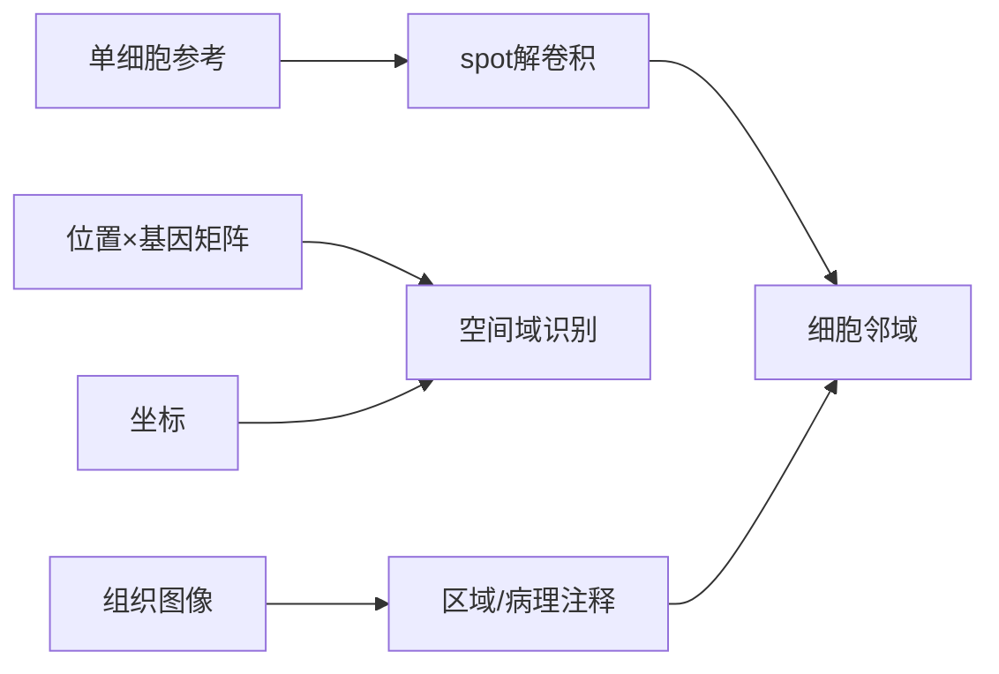

<a href="../../index.md">首页</a>›<a href="#">Part 2 分子表型组学</a>›第 6 章

<header class="chapter-header">

  
06

  
Part 2 · 分子表型组学

  <h1 class="chapter-title">空间转录组</h1>
  
空转的核心，是把表达信号放回组织坐标。

</header>

<nav class="chapter-toc"><h3>本章目录</h3><ol>
  <li>为什么需要空间信息</li>
  <li>捕获式与成像式路线</li>
  <li>数据结构和分析任务</li>
  <li>空间域、解卷积和细胞通讯</li>
  <li>常见误区</li>
  <li>案例深读：为什么表达必须放回组织坐标</li>
</ol></nav>

## 6.1为什么需要空间信息

单细胞转录组能告诉我们组织里有哪些细胞，但组织不是一袋细胞。免疫细胞是否靠近肿瘤边缘，干细胞是否位于特定微环境，病原感染是否沿血管扩散，发育信号是否形成梯度，这些问题都依赖空间位置。空间转录组保留组织坐标，使表达矩阵与组织结构、病理图像和邻域关系连接起来。

“空转”最适合回答三类问题：第一，某个基因或通路在组织中哪里表达；第二，某些细胞类型或状态是否形成空间邻域；第三，空间邻近是否支持潜在的细胞互作。它不能自动证明细胞之间真的发生了信号传递，只能提供空间共定位和表达配体-受体的证据。

## 6.2捕获式与成像式路线

捕获式空间转录组使用带空间 barcode 的阵列捕获组织切片中的 mRNA。每个 spot 或像素有固定坐标，测序后得到“位置 × 基因”的矩阵。优点是覆盖基因多，接近全转录组；弱点是分辨率受 spot 大小限制，一个 spot 可能包含多个细胞。

成像式路线通过多轮荧光原位杂交或原位测序直接在组织中读取转录本。优点是空间分辨率高，甚至可以达到单分子级；弱点是通常需要预先设计探针，检测基因数有限，实验和图像分析要求更高。

| 路线 | 代表思路 | 优势 | 局限 |
|---|---|---|---|
| 捕获式 | 空间 barcode 捕获 mRNA | 基因覆盖广，流程接近测序组学 | spot 可能混合多个细胞 |
| 成像式 | 原位杂交/测序 | 分辨率高，定位精确 | 基因面板受限，图像处理复杂 |
| 空间蛋白/多模态 | 抗体或质谱成像 | 接近功能层 | 通量和抗体质量限制 |

## 6.3数据结构和分析任务

空间转录组至少包含三类数据：表达矩阵、空间坐标和组织图像。分析不仅要做表达归一化和差异分析，还要处理图像配准、组织区域分割、空间邻接图、spot 解卷积和空间自相关。

常见任务包括识别空间高变基因、划分空间 domain、寻找区域特异通路、把单细胞参考映射到空间位置、估计细胞类型比例、分析细胞邻域和比较不同切片之间的空间模式。

## 6.4空间域、解卷积和细胞通讯

空间 domain 是表达相似且空间上连续的区域，可能对应解剖结构、病理区域或功能微环境。解卷积则试图估计每个 spot 中不同细胞类型的比例。解卷积质量高度依赖单细胞参考是否匹配：组织、物种、疾病状态和技术平台不匹配时，结果可能偏移。

细胞通讯分析通常结合配体-受体数据库和空间邻近关系。例如一个区域内成纤维细胞表达配体，邻近 T 细胞表达受体，可以提出互作假设。但这仍然是推断，不代表信号通路已经被激活。更强证据需要蛋白、磷酸化、扰动或功能实验支持。

## 6.5常见误区

第一，把 spot 当成单细胞。捕获式空转中，一个 spot 的表达常常是多细胞混合。第二，忽视组织切片质量。RNA 降解、切片厚度、组织折叠和透化条件都会影响信号。第三，把空间邻近当成互作因果。第四，在不同切片之间比较空间域时没有做配准和区域标准化。

认知升级

空间转录组的关键不是“多了一张漂亮组织图”，而是把分子变化、细胞组成和组织结构放到同一个坐标系统里解释。

## 6.6案例深读：为什么表达必须放回组织坐标

**为什么必须做空间转录组。** 单细胞解离会丢失组织位置。对于脑区、肿瘤边缘、发育胚胎、植物根尖和叶片维管束，位置不是背景信息，而是机制的一部分。没有空间坐标，就无法判断表达程序是否沿组织结构分布，也无法判断细胞邻域是否支持潜在互作。

**结果如何变成生物学结论。** Ståhl 等人在 Science 2016 提出 spatial transcriptomics，将组织切片、空间 barcode 和 RNA-seq 连接起来，使每个表达谱带有组织坐标。它的关键贡献不是单纯提高通量，而是把转录组从“样本平均值”变成“组织地图上的表达信号”。表达矩阵、组织图像和坐标共同支持 spatial domain、区域特异基因和组织结构相关表达程序的解释。

**这个案例教什么。** 空转最适合解决“变化发生在哪里”的问题。对植物尤其重要：根尖分生区、伸长区、成熟区不是任意混合的细胞群，空间位置决定发育阶段、环境暴露和细胞间通信可能性。

**参考。** Ståhl et al. 2016. *Science*. https://www.science.org/doi/10.1126/science.aaf2403

