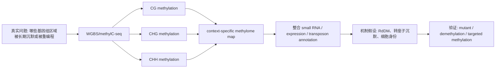

<a href="../../index.md">首页</a>›<a href="#">Part 2 分子表型组学</a>›第 8 章

<header class="chapter-header">

  
08

  
Part 2 · 分子表型组学

  <h1 class="chapter-title">DNA 甲基化与表观基因组</h1>
  
甲基化记录调控状态、细胞身份、发育历史和环境影响。

</header>

<nav class="chapter-toc"><h3>本章目录</h3><ol>
  <li>5mC 的生物学含义</li>
  <li>甲基化测量技术</li>
  <li>beta 值、M 值和 DMR</li>
  <li>与表达和细胞组成的关系</li>
  <li>常见误区</li>
  <li>CNS / 高影响案例深读：单碱基分辨率如何改变甲基化问题</li>
</ol></nav>

## 8.15mC 的生物学含义

DNA 甲基化最常指胞嘧啶 5 位甲基化（5mC）。在哺乳动物中，它主要发生在 CpG 位点。启动子 CpG island 高甲基化通常与转录沉默相关，而基因体甲基化、增强子甲基化和非 CpG 甲基化的解释更依赖细胞类型和基因组背景。

甲基化既可以是调控机制，也可以是细胞状态的记录。发育分化、细胞类型比例、年龄、炎症、肿瘤演化、环境暴露都会影响甲基化图谱。因此，甲基化研究尤其需要控制细胞组成和样本来源。

## 8.2甲基化测量技术

全基因组亚硫酸氢盐测序（WGBS）覆盖最全面，通过化学处理把未甲基化胞嘧啶转换为尿嘧啶，而甲基化胞嘧啶相对保留，从而通过测序推断甲基化状态。RRBS 通过限制性内切酶富集 CpG 密集区域，成本较低但覆盖不均。芯片方法如 EPIC array 成本更低、适合大队列，但只覆盖预设位点。

新路线还包括酶法甲基化测序和长读长甲基化检测。选择技术时要看问题：若关注全基因组调控，WGBS 更合适；若做大规模流行病学关联，芯片可能更现实；若关注重复序列、结构变异和单倍型，长读长有优势。

## 8.3beta 值、M 值和 DMR

甲基化比例常用 beta 值表示，范围 0 到 1，表示某个位点甲基化 reads 占总 reads 的比例。M 值是 beta 值的 logit 转换，更适合统计建模。差异甲基化可以在单个位点层面分析，也可以在连续区域层面识别 DMR（Differentially Methylated Region）。

DMR 通常比单个位点更稳定，因为相邻 CpG 的甲基化状态具有相关性。解释 DMR 时要关注它位于启动子、增强子、基因体、CpG island shore、重复序列还是印记区域，不同位置的功能含义不同。

## 8.4与表达和细胞组成的关系

甲基化和表达之间不是简单的负相关。启动子高甲基化常与低表达相关，但增强子去甲基化可能与增强子激活相关，基因体甲基化有时与活跃转录相关。把甲基化和 RNA-seq 结合时，应当按基因组区域分层解释。

组织样本中的甲基化差异经常反映细胞组成变化。例如血液样本中某些 CpG 差异，可能只是中性粒细胞、淋巴细胞和单核细胞比例不同。大队列甲基化分析通常需要进行细胞组成估计或使用纯化细胞。

## 8.5常见误区

第一，把甲基化差异直接解释为基因沉默。第二，忽视 SNP 对探针或比对的影响。第三，不控制年龄、性别、吸烟、细胞组成和批次。第四，把甲基化时钟、暴露标志和疾病因果混为一谈。

认知升级

甲基化是调控层，也是历史记录层。解释它时要同时问：这是驱动变化，还是细胞命运、环境和疾病过程留下的痕迹？

## 8.6CNS / 高影响案例深读：单碱基分辨率如何改变甲基化问题

**我选的案例。** Lister et al. 2008, *Cell* 的 Arabidopsis methylome 是植物表观基因组的标志性论文；Lister et al. 2009, *Nature* 的 human ESC/fibroblast methylome 展示同一测量思想如何迁移到哺乳动物细胞身份问题。对 Peter 来说，2008 年植物论文更该放在第一位。

**科研逻辑图。**

**为什么必须做甲基化。** 很多问题不是“此刻 RNA 是否高表达”，而是“某个基因组区域是否处于长期沉默、转座子压制、印记或重编程状态”。RNA 是输出，甲基化更像调控历史和染色质身份的一层记录。植物里尤其如此：CG、CHG、CHH 三种 context 分别受到不同维持机制和 RdDM 通路影响，不能用动物 CpG 思维直接套。

**原理如何支撑结论。** Bisulfite sequencing 利用未甲基化 C 被转化、5mC 相对保留的化学差异，把甲基化状态读成测序碱基差异。Lister 2008 将 methylC-seq、small RNA 和 mRNA 放到同一 Arabidopsis 基因组坐标上，能同时看甲基化位置、24nt siRNA 富集和转录沉默之间的关系。

**从实际科研逻辑怎么读。** 甲基化论文不能只看“某基因 promoter hypermethylated”。先看 genomic context：promoter、gene body、enhancer、repeat、transposon、imprinted region 的解释完全不同。植物还必须把 CG/CHG/CHH 分开，因为 CHH 强烈提示 de novo/RdDM 或 DRM2 相关活动，而 CG 更像 maintenance memory。Lister 2008 的实际价值在于把 methylome 与 small RNA 和 expression 叠加，让“甲基化在哪里”进一步转成“可能由哪条 pathway 维持、是否对应转录沉默”。

**关键结果如何支撑生物学声明。** 如果一个转座子区域同时有高 CHH methylation、24nt siRNA 和低表达，就支持 RdDM 参与沉默；如果一个基因 body 甲基化但表达不低，就不能套用 promoter methylation silencing；如果某 DMR 与表达反向变化，只能说支持调控关系，还不能证明 methylation 是原因。实际项目里，最强链条是：DMR 定位到调控区域 → 表达或小 RNA 一致变化 → 甲基化通路突变体或靶向去甲基化能改变表型。

**结论边界。** 甲基化差异不自动等于功能因果；它可能是沉默机制，也可能是细胞组成、发育阶段或转录状态的结果。WGBS 还会受 bisulfite damage、mapping bias 和 SNP 影响。今天重做植物 methylome，应加入 long-read methylation、单细胞/空间甲基化和 RdDM 小 RNA 扰动，区分旁观者甲基化与功能性 DMR。

**参考。** Lister et al. 2008. *Cell*. https://doi.org/10.1016/j.cell.2008.03.029；Lister et al. 2009. *Nature*. https://www.nature.com/articles/nature08514

