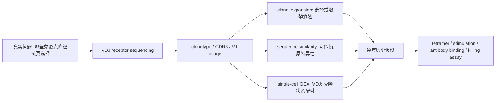

<a href="../../index.md">首页</a>›<a href="#">Part 3 免疫与微生态</a>›第 9 章

<header class="chapter-header">

  
09

  
Part 3 · 免疫与微生态

  <h1 class="chapter-title">BCR 与 TCR 免疫组库</h1>
  
用受体序列追踪克隆扩增、抗原经验和免疫动态。

</header>

<nav class="chapter-toc"><h3>本章目录</h3><ol>
  <li>V(D)J 重排与 CDR3</li>
  <li>BCR 与 TCR 的差异</li>
  <li>bulk 与单细胞 VDJ</li>
  <li>克隆型、丰度和多样性</li>
  <li>解释边界</li>
  <li>CNS / 高影响案例深读：克隆型如何连接免疫状态</li>
</ol></nav>

本章学习导向：BCR/TCR 免疫组库一般为了解决什么问题？

<strong>常见问题。</strong> 免疫组库用来追踪克隆扩增、抗原经验、疫苗反应、肿瘤浸润、自身免疫和抗体亲和成熟。它回答的不是“哪些基因表达高”，而是“哪些淋巴细胞克隆被选择、扩增或保留下来”。

<strong>一般分析思路。</strong> 先做 V(D)J 比对和 clonotype 定义，再分析克隆丰度、多样性、V/J 使用、CDR3 motif、组织/时间共享；BCR 进一步看 SHM、clonal lineage 和 isotype，单细胞 VDJ 则把受体序列和细胞状态配对。

<strong>为什么这样分析。</strong> 免疫受体序列是天然 lineage barcode。克隆扩增提示选择历史，但不直接告诉你抗原是谁；BCR 突变树和类别转换提示 germinal center 和亲和成熟；TCR 扩增需要结合细胞状态和抗原验证。

<strong>生物学主线。</strong> 组库记录的是生成、筛选、抗原刺激、扩增、记忆和组织迁移的历史。读结果时要把“克隆是否变大”“克隆处于什么细胞状态”“有没有抗原特异性证据”分开。

## 9.1V(D)J 重排与 CDR3

B 细胞和 T 细胞通过 V(D)J 重排产生高度多样的抗原受体。TCR 识别抗原肽-MHC 复合物，BCR 可以识别天然抗原。重排过程中 V、D、J 片段组合，并在连接处产生插入和删除，形成高度多样的 CDR3 区域。CDR3 通常是定义克隆型的核心。

免疫组库测序的基本问题是：样本中有哪些受体序列，它们各自有多少，是否出现克隆扩增，不同组织或时间点之间是否共享克隆。

### 生物学补充：免疫组库记录的是选择历史

V(D)J 重排由 RAG1/RAG2 识别 recombination signal sequences，切开 DNA 后重新连接 V、D、J 片段。连接处还会发生核苷酸删除和 TdT 介导的 N nucleotide addition，因此 CDR3 多样性远远超过基因组中预先编码的片段数。随后，能正确表达受体、不过度自身反应、并在合适抗原环境中获得信号的淋巴细胞才会存活和扩增。组库不是随机序列库，而是生成、选择、扩增和记忆共同留下的历史。

Burnet 的 clonal selection 思想可以帮助读组库：每个克隆带着相对固定的受体特异性，抗原刺激选择并扩增少数克隆。感染、疫苗、肿瘤和自身免疫都会在 repertoire 中留下偏斜：某些克隆变大、某些 V/J 使用偏移、某些组织出现共享克隆。TCR 侧，这种偏斜主要读作抗原经验和 T 细胞状态；BCR 侧，还能进一步读出 germinal center 反应、亲和成熟和抗体类别转换。

<figure class="source-figure" markdown="1">
  
  <figcaption><strong>图 9.1 · V(D)J recombination。</strong> 免疫组库多样性的来源不是随机测序噪音，而是 V、D、J 片段组合、连接处插入/删除和后续选择共同塑造的序列空间。读 clonotype 前，先把这个机制图看明白。来源：Jmarchn, <a href="https://commons.wikimedia.org/wiki/File:V(D)J_recombination-diagram.svg">Wikimedia Commons</a>, CC BY-SA 3.0。</figcaption>
</figure>

## 9.2BCR 与 TCR 的差异

TCR 通常由 alpha/beta 链或 gamma/delta 链组成。TCR 克隆扩增可以提示抗原驱动反应，但仅凭 CDR3 序列很难确定抗原特异性。BCR 除了 V(D)J 重排，还会经历体细胞高突变和类别转换，因此 BCR 组库可以提供亲和成熟、谱系树和抗体类别信息。

| 特征 | TCR | BCR |
|---|---|---|
| 主要功能 | 识别肽-MHC | 识别天然抗原 |
| 后续变化 | 克隆扩增为主 | 高突变、类别转换、克隆扩增 |
| 关键分析 | 克隆型、共享、扩增 | 克隆谱系、突变率、isotype |
| 抗原判断 | 需数据库或实验验证 | 可结合抗体功能验证 |

BCR 的额外信息来自生发中心。B 细胞遇到抗原后进入 germinal center，AID 介导 somatic hypermutation，让 immunoglobulin 可变区积累点突变；能更强结合抗原的细胞获得 Tfh 帮助并继续扩增，这就是 affinity maturation。AID 还参与 class switch recombination，让同一抗原特异性的 B 细胞从 IgM/IgD 转为 IgG、IgA 或 IgE，从而改变效应功能。因此 BCR 组库里，同一 clonal family 的突变树、突变负荷和 isotype 分布，本身就是免疫反应质量的读数。

TCR 不经历 SHM 和 CSR，它的解释重点是 TCR-pMHC 识别、胸腺选择和外周扩增。一个 TCR 克隆扩增，常提示某种抗原驱动或局部增殖，但 TCR 的交叉反应性很强：同一 TCR 可能识别多个肽，不同 TCR 也可能收敛到同一抗原。因此 TCR 组库天然适合提出“抗原选择痕迹”，不适合单独给出“抗原身份结论”。

## 9.3bulk 与单细胞 VDJ

bulk 免疫组库通量高、适合估计整体多样性和克隆扩增，但难以配对 alpha/beta 或 heavy/light chain，也缺少细胞表型信息。单细胞 VDJ 可以把受体序列与单细胞表达谱连接起来，知道某个扩增克隆属于耗竭 T 细胞、浆细胞还是记忆细胞。

单细胞 VDJ 的价值在于“序列 + 状态”联合解释。例如肿瘤中一个扩增 TCR 克隆如果同时具有细胞毒性和耗竭表达特征，可能提示持续抗原刺激；疫苗后 BCR 克隆若出现高突变和类别转换，可能提示成熟抗体反应。

## 9.4克隆型、丰度和多样性

常见指标包括 clonotype count、克隆丰度、Shannon diversity、Simpson clonality、Gini index、public clonotype 和 clonal overlap。克隆扩增意味着某些受体序列占比升高，常见于感染、肿瘤、疫苗接种、自身免疫或组织局部免疫反应。

多样性解释要结合采样深度。测得越深，低丰度克隆越容易被发现；样本细胞数不同会影响多样性估计。比较不同样本前通常需要稀释、归一化或使用对测序深度相对稳健的指标。

## 9.5解释边界

克隆扩增不等于已经知道抗原。相同或相似 TCR 可能识别不同抗原，不同 TCR 也可能识别同一抗原。BCR 序列相似不代表抗体功能相同。免疫组库提供的是免疫历史和克隆动态线索，抗原特异性仍需要 tetramer、抗原刺激、抗体结合或功能实验验证。

关键问题

免疫组库结果要同时看三件事：克隆是否扩增，扩增克隆处于什么细胞状态，是否有独立证据支持抗原特异性。

## 9.6CNS / 高影响案例深读：克隆型如何连接免疫状态

**我选的案例。** BCR 侧选 Briney et al. 2019, *Nature*，因为它把“人类抗体组库有多大”变成可测量问题；TCR 侧选 Glanville et al. 2017, *Nature* 和 Yost et al. 2019, *Nature Medicine*，分别代表抗原特异性聚类和单细胞 RNA/TCR 联合解释免疫治疗。

**科研逻辑图。**

**为什么必须做 BCR/TCR。** scRNA-seq 能告诉你 T 细胞处于 exhausted、cytotoxic 或 proliferative 状态，但不能告诉你这些细胞是否来自同一个克隆，也不能追踪抗原选择历史。TCR/BCR 组库把免疫受体序列作为天然 lineage barcode；BCR 还携带 SHM、isotype 和 clonal family 信息，能读出亲和成熟与抗体谱系。

**原理如何支撑结论。** 组库测序的统计单位不是基因，而是重排后的 receptor sequence，尤其是 CDR3。Briney 用大规模 BCR sequencing 估计 clonal diversity 和共享程度，回答“人类抗体空间到底有多大”。Glanville 的 GLIPH 逻辑是：识别同一抗原的 TCR 往往在 CDR3 motifs、长度和 V gene 使用上有局部相似性，因此可以从 repertoire 中聚类出 specificity groups。Yost 则把 TCR clonotype 和 scRNA cell state 合并，区分“同一克隆状态改变”与“治疗后新克隆进入肿瘤”。

**从实际科研逻辑怎么读。** 免疫组库论文先看“克隆定义”而不是先看 diversity index。CDR3 完全相同、CDR3 相似、同一 V/J、同一 heavy-light pair，代表不同强度的 clonality 证据。其次看采样单位：血液、肿瘤、淋巴结和组织驻留细胞的 repertoire 含义不同。Yost 的逻辑强在它不是只说某些 T cells exhausted，而是问治疗前后同一克隆是否保留、扩增或被替换；这就把“细胞状态图谱”升级成“免疫动态”。

**关键结果如何支撑生物学声明。** clonotype expansion 支持抗原经历或局部选择，但不告诉你抗原是谁；TCR similarity clustering 支持 specificity group 假设，但仍需抗原验证；单细胞 GEX+TCR 如果显示某个扩增克隆同时处于 cytotoxic/exhausted 状态，才支持“该抗原经验克隆参与局部免疫反应”。BCR 里，如果同一 clonal family 呈现 SHM 梯度和 class switch，则支持 germinal center selection 和 affinity maturation 的历史。

**结论边界。** 克隆扩增不等于已知抗原；相似 CDR3 不保证同一 specificity；bulk BCR 不能配 heavy/light chain，bulk TCR 不能可靠配 alpha/beta。强证据需要 tetramer、抗原刺激、抗体结合、结构生物学或功能杀伤实验。单细胞 VDJ 解决配对和状态问题，但会受捕获率、doublet、低频克隆和组织采样偏差影响。

**参考。** Briney et al. 2019. *Nature*. https://www.nature.com/articles/s41586-019-0879-y；Glanville et al. 2017. *Nature*. https://www.nature.com/articles/nature22976；Yost et al. 2019. *Nature Medicine*. https://www.nature.com/articles/s41591-019-0522-3

