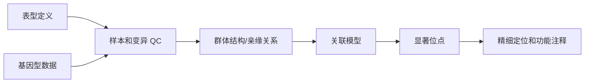
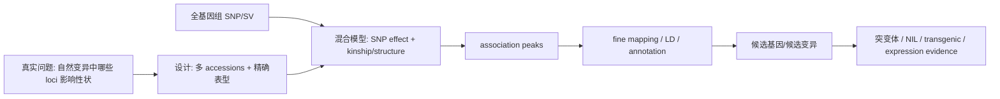

<a href="../../index.md">首页</a>›<a href="#">Part 4 遗传变异与数量性状</a>›第 11 章

<header class="chapter-header">

  
11

  
Part 4 · 遗传变异与数量性状

  <h1 class="chapter-title">GWAS 与群体遗传</h1>
  
用自然群体中的遗传变异定位影响性状的基因组区域。

</header>

<nav class="chapter-toc"><h3>本章目录</h3><ol>
  <li>GWAS 的基本思想</li>
  <li>连锁不平衡和群体结构</li>
  <li>标准分析流程</li>
  <li>从关联位点到候选基因</li>
  <li>常见误区</li>
  <li>CNS / 高影响案例深读：植物 GWAS 如何从关联走向候选机制</li>
</ol></nav>

## 11.1GWAS 的基本思想

GWAS（Genome-Wide Association Study）在全基因组范围内检验遗传变异与表型之间的统计关联。基本模型是：对每个 SNP，比较不同基因型个体的表型是否系统性不同。对于二分类疾病常用 logistic model，对于连续性状常用 linear model 或 mixed model。

GWAS 的优势是无需预先指定候选基因，可以在自然群体中发现影响性状的基因组区域。局限是它通常定位到关联区域，而不是直接定位到因果变异；它对常见变异更有力，对罕见变异、结构变异和复杂环境互作的能力有限。

## 11.2连锁不平衡和群体结构

连锁不平衡（LD）指相邻变异在群体中非随机共遗传。GWAS 命中的 SNP 往往只是与因果变异处在 LD 中的标记位点。LD 既帮助我们用有限 SNP 捕获附近遗传信息，也限制了定位分辨率。

群体结构是 GWAS 的主要混杂来源。如果病例和对照来自不同祖源群体，某些 SNP 频率差异可能反映祖源差异，而不是疾病原因。主成分校正、线性混合模型、亲缘关系矩阵和严格样本 QC 都是控制群体结构的重要方法。

## 11.3标准分析流程

GWAS 通常包括表型 QC、基因型 QC、缺失率过滤、MAF 过滤、Hardy-Weinberg equilibrium 检查、亲缘关系检查、祖源 PCA、基因型填充、关联模型、全基因组显著性校正、QQ plot、Manhattan plot 和重复队列验证。

## 11.4从关联位点到候选基因

显著位点附近最近的基因不一定是因果基因。许多 GWAS 信号位于非编码调控区域，可能通过远端增强子影响目标基因。候选基因推断常需要结合 eQTL、染色质可及性、染色质互作、保守性、细胞类型特异表达、精细定位和功能实验。

多基因性状通常由大量小效应变异共同影响。单个位点解释的表型方差可能很小，但多基因风险评分（PRS）可以聚合许多位点进行风险预测。PRS 的可迁移性受祖源和队列差异影响很大。

## 11.5常见误区

第一，把关联 SNP 当作因果突变。第二，把最近基因当作因果基因。第三，忽视群体结构和表型定义质量。第四，用一个祖源群体训练的 PRS 直接推广到另一个祖源群体。第五，只看 p 值，不看效应大小、频率和复现。

关键问题

GWAS 命中后最重要的问题不是“这个 SNP 显著吗”，而是“它通过哪个变异、哪个细胞类型、哪个调控机制影响表型”。

## 11.6CNS / 高影响案例深读：植物 GWAS 如何从关联走向候选机制

**我选的案例。** Atwell et al. 2010, *Nature* 是 Arabidopsis GWAS 经典；Huang et al. 2012, *Nature* 是水稻群体基因组与驯化经典。前者最适合学习“植物自然群体里如何做 GWAS”，后者适合学习“GWAS/群体变异如何回答驯化与选择”。

**科研逻辑图。**

**为什么必须做 GWAS/群体基因组。** 当问题是“自然变异中哪些等位基因塑造性状”，转录组只能给状态，不能给遗传原因。GWAS 直接利用自然群体中的 recombination history 和 LD，把 phenotype variation 映射到 genotype variation。植物尤其适合，因为自交、地方适应、驯化和广泛自然 accessions 提供了丰富的遗传结构。

**原理如何支撑结论。** Atwell 对 107 个 Arabidopsis 表型做 genome-wide association，把每个 SNP 作为 fixed effect，同时面对两个核心统计问题：LD 决定定位分辨率，population structure 决定假阳性风险。它的教育价值在于：很多性状可以找到接近已知生物学基因的峰，但许多峰也受样本量、群体结构和小效应限制。Huang 的水稻研究进一步用大规模 SNP 图谱、群体分化和选择扫荡，把关联位点放回驯化历史。

**从实际科研逻辑怎么读。** GWAS 论文先看 phenotype quality。表型噪音大，模型再高级也只会得到弱信号。其次看群体结构：Arabidopsis 和水稻都有强地理/祖源结构，若结构和表型共同变化，普通线性模型会把祖源差异误报成性状位点。Atwell 的意义在于它把 mixed model 和自然 accessions 的植物 GWAS 推成范式；Huang 的意义在于用群体变异和选择信号把性状关联放进驯化历史。

**关键结果如何支撑生物学声明。** Manhattan peak 只支持“某区域与表型关联”。如果 peak 附近有已知通路基因，支持候选基因；如果该区域还显示 selection sweep，支持驯化相关；如果 allele effect 在独立群体复现，支持稳健性。只有当突变体、近等基因系或转基因改变表型时，才真正从 association 进入 causation。对植物 PI 来说，最实用的读法是把 GWAS peak 当作“候选机制入口”，不是最终答案。

**结论边界。** GWAS peak 不是因果突变，最近基因不是因果基因；植物强群体结构和环境适应会制造假阳性；多倍体或高度自交物种还会让模型更复杂。强结论需要 fine mapping、候选基因表达、突变体、互补实验或 near-isogenic lines。今天重做应加入 pangenome graph、SV、环境 GWAS、multi-omics QTL 和混合模型/regenie 类算法。

**参考。** Atwell et al. 2010. *Nature*. https://www.nature.com/articles/nature08800；Huang et al. 2012. *Nature*. https://www.nature.com/articles/nature11532

