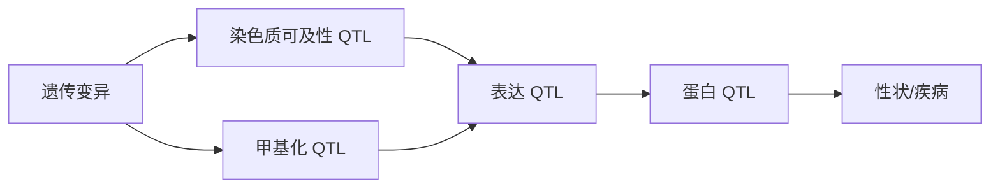

<a href="../../index.md">首页</a>›<a href="#">Part 4 遗传变异与数量性状</a>›第 12 章

<header class="chapter-header">

  
12

  
Part 4 · 遗传变异与数量性状

  <h1 class="chapter-title">eQTL 与多组学关联</h1>
  
把遗传变异和分子表型连接起来，缩短 GWAS 到机制的距离。

</header>

<nav class="chapter-toc"><h3>本章目录</h3><ol>
  <li>QTL 的基本概念</li>
  <li>cis、trans 和细胞类型特异性</li>
  <li>共定位、TWAS 和孟德尔随机化</li>
  <li>从 eQTL 扩展到多组学 QTL</li>
  <li>解释风险</li>
  <li>案例深读：GTEx 如何把遗传变异连接到分子机制</li>
</ol></nav>

## 12.1QTL 的基本概念

QTL（Quantitative Trait Locus）是影响数量性状的遗传位点。eQTL 研究遗传变异如何影响基因表达；sQTL 研究剪接；meQTL 研究甲基化；caQTL 研究染色质可及性；pQTL 研究蛋白水平；mQTL 研究代谢物。它们都把遗传变异与中间分子表型连接起来。

eQTL 的基本模型是：某个 SNP 的基因型是否解释某个基因表达的差异。如果一个 GWAS 位点同时也是某基因的 eQTL，那么该基因可能介导遗传风险，但还需要更严格的共定位和功能证据。

## 12.2cis、trans 和细胞类型特异性

cis-eQTL 通常指距离目标基因较近的变异影响该基因表达，效应较容易检测和解释。trans-eQTL 指远端变异影响其他基因表达，可能通过转录因子、信号通路或细胞组成间接产生，效应更复杂，也更容易受混杂影响。

eQTL 具有强烈的组织和细胞类型特异性。一个变异可能只在肝细胞、免疫细胞或特定刺激条件下影响表达。疾病相关 GWAS 位点若落在免疫细胞特异 enhancer 中，用全血平均表达或不相关组织做 eQTL 可能看不到真实机制。

## 12.3共定位、TWAS 和孟德尔随机化

共定位分析问的是：GWAS 信号和 eQTL 信号是否可能由同一个因果变异驱动。它比“显著位点重叠”更严格，因为 LD 可以让不同因果变异看起来在同一区域。

TWAS 通过遗传预测的表达量与性状关联，寻找可能介导性状的基因。孟德尔随机化利用遗传变异作为工具变量，评估分子表型对疾病的潜在因果影响。这些方法都依赖工具变量、LD、共定位和模型假设，不能机械解释为因果证明。

## 12.4从 eQTL 扩展到多组学 QTL

多组学 QTL 可以构建更完整链条：GWAS 变异影响 chromatin accessibility，accessibility 影响表达，表达影响蛋白，蛋白影响代谢和表型。这样的链条比单独 eQTL 更接近机制，但每一层都可能有组织特异性、时间特异性和测量噪音。

## 12.5解释风险

QTL 整合最常见的错误，是把“同一区域存在多个信号”直接解释为同一机制。LD、多个因果变异、组织不匹配、细胞组成、反向因果和选择偏倚都可能造成误导。稳健解释通常需要共定位、精细定位、细胞类型注释、扰动实验和独立队列复现。

认知升级

QTL 的价值在于把遗传关联拉向分子机制，但它仍然是统计桥梁。桥梁越长，越需要中间支撑。

## 12.6案例深读：GTEx 如何把遗传变异连接到分子机制

**为什么必须做 eQTL。** GWAS 常把信号定位到非编码区域，但不知道它影响哪个基因、在哪个组织或细胞类型起作用。eQTL 把遗传变异和表达水平连接起来，是从关联位点走向机制的重要中间层。

**结果如何变成生物学结论。** GTEx Consortium 在 Science 2020 构建跨人体组织的遗传调控图谱，系统比较 cis-eQTL、组织特异调控和跨组织共享效应。一个 GWAS locus 如果与某组织中的 eQTL 共定位，就能把“风险变异”推进到“可能通过某组织、某基因表达影响表型”的机制假设。

**这个案例教什么。** eQTL 能解决“遗传变异可能调控哪个基因、在哪个组织起作用”的问题；但 eQTL 与 GWAS 信号重叠不等于因果，必须做共定位、精细定位和功能验证。

**参考。** GTEx Consortium. 2020. *Science*. https://www.science.org/doi/10.1126/science.aaz1776

