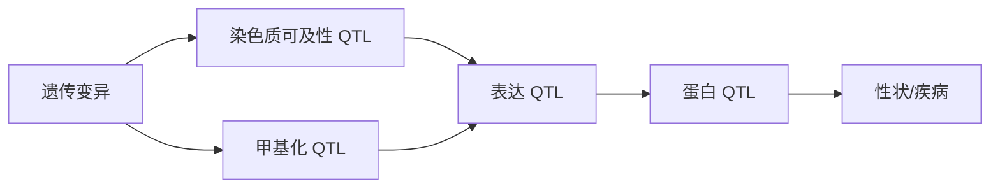

<a href="../../index.md">首页</a>›<a href="#">Part 4 遗传变异与数量性状</a>›第 12 章

<header class="chapter-header">

  
12

  
Part 4 · 遗传变异与数量性状

  <h1 class="chapter-title">eQTL 与多组学关联</h1>
  
把遗传变异和分子表型连接起来，缩短 GWAS 到机制的距离。

</header>

<nav class="chapter-toc"><h3>本章目录</h3><ol>
  <li>QTL 的基本概念</li>
  <li>cis、trans 和细胞类型特异性</li>
  <li>共定位、TWAS 和孟德尔随机化</li>
  <li>从 eQTL 扩展到多组学 QTL</li>
  <li>解释风险</li>
  <li>CNS / 高影响案例深读：GTEx 如何把遗传变异连接到分子机制</li>
</ol></nav>

## 12.1QTL 的基本概念

QTL（Quantitative Trait Locus）是影响数量性状的遗传位点。eQTL 研究遗传变异如何影响基因表达；sQTL 研究剪接；meQTL 研究甲基化；caQTL 研究染色质可及性；pQTL 研究蛋白水平；mQTL 研究代谢物。它们都把遗传变异与中间分子表型连接起来。

eQTL 的基本模型是：某个 SNP 的基因型是否解释某个基因表达的差异。如果一个 GWAS 位点同时也是某基因的 eQTL，那么该基因可能介导遗传风险，但还需要更严格的共定位和功能证据。

## 12.2cis、trans 和细胞类型特异性

cis-eQTL 通常指距离目标基因较近的变异影响该基因表达，效应较容易检测和解释。trans-eQTL 指远端变异影响其他基因表达，可能通过转录因子、信号通路或细胞组成间接产生，效应更复杂，也更容易受混杂影响。

eQTL 具有强烈的组织和细胞类型特异性。一个变异可能只在肝细胞、免疫细胞或特定刺激条件下影响表达。疾病相关 GWAS 位点若落在免疫细胞特异 enhancer 中，用全血平均表达或不相关组织做 eQTL 可能看不到真实机制。

## 12.3共定位、TWAS 和孟德尔随机化

共定位分析问的是：GWAS 信号和 eQTL 信号是否可能由同一个因果变异驱动。它比“显著位点重叠”更严格，因为 LD 可以让不同因果变异看起来在同一区域。

TWAS 通过遗传预测的表达量与性状关联，寻找可能介导性状的基因。孟德尔随机化利用遗传变异作为工具变量，评估分子表型对疾病的潜在因果影响。这些方法都依赖工具变量、LD、共定位和模型假设，不能机械解释为因果证明。

## 12.4从 eQTL 扩展到多组学 QTL

多组学 QTL 可以构建更完整链条：GWAS 变异影响 chromatin accessibility，accessibility 影响表达，表达影响蛋白，蛋白影响代谢和表型。这样的链条比单独 eQTL 更接近机制，但每一层都可能有组织特异性、时间特异性和测量噪音。

## 12.5解释风险

QTL 整合最常见的错误，是把“同一区域存在多个信号”直接解释为同一机制。LD、多个因果变异、组织不匹配、细胞组成、反向因果和选择偏倚都可能造成误导。稳健解释通常需要共定位、精细定位、细胞类型注释、扰动实验和独立队列复现。

认知升级

QTL 的价值在于把遗传关联拉向分子机制，但它仍然是统计桥梁。桥梁越长，越需要中间支撑。

## 12.6CNS / 高影响案例深读：GTEx 如何把遗传变异连接到分子机制

**我选的案例。** GTEx Consortium 2020, *Science*。它不是单一疾病论文，而是跨组织遗传调控图谱，最适合学习 eQTL 的核心价值：把 GWAS 的非编码位点翻译成组织、基因和调控方向的机制假设。

**为什么必须做 eQTL。** GWAS 常把信号定位到非编码区域，但不知道它影响哪个基因、在哪个组织或细胞类型起作用。最近基因原则会经常错，因为 enhancer 可以远距离调控，LD 又会让多个变异共享信号。eQTL 把 genotype 和 expression 放在同一批个体中建模，是从关联位点走向分子机制的桥梁。

**原理如何支撑结论。** GTEx 的基本统计问题是对每个 variant-gene pair 拟合表达量与基因型剂量的关系，同时控制 batch、hidden factors、sex、ancestry 和 tissue context。cis-eQTL 说明近端变异影响基因表达；跨组织比较说明调控效应是否共享；共定位分析进一步问 GWAS 和 eQTL 是否可能由同一 causal variant 驱动，而不是只看两个 Manhattan peak 是否重叠。

**结果解决了什么生物学问题。** GTEx 把“疾病风险 SNP”推进到“可能在哪个组织调控哪个基因”。它还能显示许多调控效应强烈组织特异：一个免疫疾病位点可能只在血液或免疫细胞相关组织里有表达效应，一个代谢性状位点可能在 liver、adipose 或 pancreas 更有解释力。对于植物，同样逻辑可以迁移到 eQTL、sQTL、caQTL 和 meQTL：关键是组织、发育阶段和刺激条件要匹配性状发生场景。

**结论边界。** eQTL 不是因果证明。一个 GWAS locus 和 eQTL locus 重叠可能来自 LD 中两个不同 causal variants；表达变化也可能是 downstream effect。GTEx 以 bulk tissue 为主，细胞组成会稀释或制造信号。今天重做应加入 single-cell eQTL、spatial eQTL、多组学 QTL、fine mapping 和 CRISPR perturbation，才能把“共定位假设”推向“调控机制”。

**参考。** GTEx Consortium. 2020. *Science*. https://www.science.org/doi/10.1126/science.aaz1776

