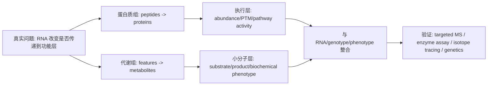

<a href="../../index.md">首页</a>›<a href="#">Part 5 多组学整合</a>›第 13 章

<header class="chapter-header">

  
13

  
Part 5 · 多组学整合

  <h1 class="chapter-title">蛋白质组与代谢组</h1>
  
越接近功能层，越接近表型，也越接近测量复杂性。

</header>

<nav class="chapter-toc"><h3>本章目录</h3><ol>
  <li>为什么 RNA 不够</li>
  <li>蛋白质组的测量逻辑</li>
  <li>代谢组的测量逻辑</li>
  <li>缺失值、批次和注释等级</li>
  <li>与其他组学整合</li>
  <li>CNS / 高影响案例深读：为什么 RNA 不够</li>
</ol></nav>

本章学习导向：蛋白质组和代谢组一般为了解决什么问题？

<strong>常见问题。</strong> 蛋白质组和代谢组用来问“系统真正执行了什么功能”。RNA 告诉你表达潜力，蛋白质组更接近执行层，磷酸化等 PTM 更接近信号活性，代谢组更接近生理状态和表型。

<strong>一般分析思路。</strong> 蛋白质组先从肽段质谱鉴定和定量推断蛋白，再分析差异蛋白、PTM、通路和复合体；代谢组先做 peak detection、alignment、归一化和注释等级判断，再分析差异 metabolite、通路、酶-底物关系和绝对/靶向验证。

<strong>为什么这样分析。</strong> 质谱信号受动态范围、离子化效率、缺失值、批次和注释不确定性影响。蛋白丰度不等于活性，代谢物丰度不等于通量，因此必须区分 abundance、PTM、localization、enzyme activity 和 isotope flux。

<strong>生物学主线。</strong> 功能层的核心是活性、位置、复合体和通量。读结果时要问：RNA 变化有没有传到蛋白？蛋白变化有没有改变活性？代谢物变化是上游输入增强，还是下游反应堵塞？

零基础生物学底座：蛋白和代谢物为什么更接近功能？

蛋白是细胞里真正执行很多工作的分子：酶催化反应，受体接收信号，转录因子调控基因，结构蛋白支撑细胞形态。RNA 变多只是说明工作单变多，蛋白是否真的变多、是否被修饰、是否在正确位置，才更接近功能执行。

代谢物是细胞化学反应的底物、产物和信号分子，例如糖、氨基酸、脂质、激素、次生代谢物。它们离表型很近，但也变化很快，受时间、组织、环境、微生物和取样方式影响。蛋白质组和代谢组让我们从“细胞想做什么”走向“细胞实际在做什么”。

## 13.1为什么 RNA 不够

RNA 表达提供转录状态，但许多功能由蛋白丰度、蛋白修饰、复合体形成、酶活性和代谢物浓度决定。一个激酶的 mRNA 不变，磷酸化活性可能大幅改变；一个代谢通路的基因表达升高，也不代表通量一定升高。因此蛋白质组和代谢组是理解功能表型的重要层级。

### 生物学补充：功能层的关键是活性、位置和通量

蛋白的功能不只由丰度决定。酶需要正确折叠、定位到正确细胞器、装配成复合体，并在合适底物、辅因子和修饰状态下工作。激酶、转录因子、受体和代谢酶尤其如此：总蛋白不变时，磷酸化、泛素化、乙酰化、氧化还原状态或配体结合都可能让活性发生巨大改变。蛋白质组如果只测 abundance，只看到了功能层的一部分；PTM 组学、互作组、亚细胞定位和酶活实验才更接近机制。

代谢物也不等于通量。某个中间产物升高，可能因为上游输入增强，也可能因为下游反应被堵住；某条代谢通路基因表达升高，不代表碳流或氮流真的经过那里。要证明通量，需要 isotope tracing、酶活、底物/产物比、细胞器定位和时间序列。植物代谢尤其要小心：次生代谢物常有组织特异性、昼夜节律和诱导性，叶片、根、种子和病斑边缘的代谢意义完全不同。

<figure class="source-figure" markdown="1">
  
  <figcaption><strong>图 13.1 · LC-MS/MS procedure。</strong> 蛋白质组和代谢组不是直接“读出分子名字”，而是先经过分离、离子化、质荷比检测和碎裂谱图匹配。理解这个流程，才能理解为什么缺失值、离子抑制、注释等级和标准品验证如此重要。来源：Nanita, <a href="https://commons.wikimedia.org/wiki/File:Schematic_depiction_of_LC-MS_MS_procedure..jpg">Wikimedia Commons</a>, CC BY-SA 4.0。</figcaption>
</figure>

## 13.2蛋白质组的测量逻辑

质谱蛋白质组通常先把蛋白酶切成肽段，再用 LC-MS/MS 测量肽段，最后推断蛋白。DDA（data-dependent acquisition）选择强信号离子碎裂，适合发现；DIA（data-independent acquisition）系统性碎裂窗口内离子，重现性更好。定量可以是 label-free，也可以使用 TMT 等标记策略。

蛋白质组的核心挑战包括动态范围大、低丰度蛋白难检测、肽段到蛋白的归属不唯一、批次效应明显和缺失值非随机。磷酸化、泛素化、乙酰化等修饰组学还需要富集步骤，解释更接近信号通路活性。

## 13.3代谢组的测量逻辑

代谢组测量小分子代谢物。靶向代谢组预先选择一组代谢物，定量更可靠；非靶向代谢组覆盖更广，但注释不确定性更高。常用平台包括 LC-MS、GC-MS 和 NMR。不同平台对极性、挥发性、稳定性和定量范围的适配不同。

代谢物离表型很近，但也受饮食、昼夜节律、取样时间、保存条件、药物、微生物和组织缺血时间影响。代谢组实验的样本采集和保存标准化非常关键。

## 13.4缺失值、批次和注释等级

蛋白质组和代谢组中的缺失值往往不是随机缺失，而是低丰度、检测限、离子抑制或峰识别失败造成。简单填补可能引入假信号。批次校正需要 QC 样本、内标、随机上机和漂移校正。

代谢物注释要区分等级。精确质量和数据库匹配只能给候选，MS/MS 谱图匹配更强，标准品确认最可靠。非靶向代谢组中“显著 feature”不等于已经明确知道化合物身份。

## 13.5与其他组学整合

蛋白质组可以验证 RNA 变化是否传递到功能层；磷酸化组可以提示信号通路激活；代谢组可以连接微生物、宿主通路和表型。整合时不要强求每个 RNA 都有对应蛋白，也不要期望代谢物和基因表达一一对应。更合理的是按通路、酶-底物关系和机制模型整合。

一个实用整合顺序是：先用 RNA 找到响应细胞程序，再用蛋白验证执行层是否同步，再用 PTM 或代谢物判断活性和通量，最后用表型或扰动验证机制。若 RNA 上调但蛋白不变，可能有翻译或蛋白稳定性控制；若蛋白上调但代谢物不变，可能通量由底物限制；若代谢物大变但 RNA/蛋白不变，可能来自微生物、饮食/培养基、环境输入或酶活调控。真正的多组学解释要允许这些“不一致”，因为不一致往往就是机制入口。

认知升级

蛋白质组和代谢组更接近“系统在做什么”，但也更依赖样本处理和仪器稳定性。功能层数据越有价值，前处理越不能随意。

## 13.6CNS / 高影响案例深读：为什么 RNA 不够

**我选的案例。** 蛋白质组选 Kim et al. 2014 和 Wilhelm et al. 2014 两篇 *Nature* human proteome draft；代谢组选 Chen et al. 2014, *Nature Genetics* 的 rice metabolome GWAS。这样一组刚好覆盖“蛋白是否真的被表达”和“代谢物如何连接基因型与生化表型”。

**科研逻辑图。**

**为什么必须做蛋白质组/代谢组。** RNA 是表达潜力，蛋白和代谢物更接近功能执行。翻译效率、蛋白降解、磷酸化、复合体状态和酶活性都会让 RNA 与表型脱钩。代谢物更进一步：它们是酶反应、营养状态、微生物活动和环境扰动的综合输出，常常比 mRNA 更贴近生理状态。

**原理如何支撑结论。** 质谱蛋白质组把蛋白酶切成 peptides，经 LC-MS/MS 碎裂后用谱图匹配回蛋白序列。Kim/Wilhelm 的关键不是“检测很多蛋白”本身，而是把 peptides evidence 与 genome annotation、transcript evidence 对齐，问哪些 predicted coding genes 真的有蛋白层支持。代谢组则把 LC-MS/GC-MS/NMR 的 feature 与标准品或 MS2 谱图连接；Chen 的 rice mGWAS 把 metabolite abundance 当数量性状，与 SNP 做关联，寻找控制代谢自然变异的遗传位点。

**从实际科研逻辑怎么读。** 蛋白质组论文要先看 peptide evidence 的质量：唯一肽段、FDR、缺失值结构、动态范围、是否有批次 QC。代谢组论文要先看 annotation level：feature、putative compound、MS2 supported、standard confirmed 的结论强度不同。Chen 的 rice mGWAS 的逻辑强在把代谢物当 phenotype，而不是把代谢物只当富集输入；这样能从 SNP → metabolite → pathway → agronomic/biochemical trait 建机制链。

**关键结果如何支撑生物学声明。** 如果某蛋白有多个 unique peptides，且跨组织/条件定量稳定，才支持“该蛋白存在并变化”；如果某 PTM 改变但总蛋白不变，支持“活性调控而非表达调控”；如果某 metabolite 与 SNP 强关联，且候选基因编码相关酶或转运蛋白，支持“遗传变异控制代谢积累”。这类证据比 RNA 富集更接近功能，但也更依赖前处理和注释质量。植物特化代谢物尤其要小心：一个显著 LC-MS feature 不等于已经知道化合物结构。

**结论边界。** 蛋白组的 peptide-to-protein inference 不唯一，低丰度和膜蛋白难测，缺失值常常 MNAR；代谢组 feature 不等于已注释 metabolite，MS2 匹配也不是标准品确认。今天重做应把 DIA、深度 spectral library、PTM enrichment、isotope tracing、absolute quantification 和 genotype/phenotype integration 放到同一设计里，而不是只做 RNA 与 protein/metabolite 的相关热图。

**参考。** Kim et al. 2014. *Nature*. https://www.nature.com/articles/nature13302；Wilhelm et al. 2014. *Nature*. https://www.nature.com/articles/nature13319；Chen et al. 2014. *Nature Genetics*. https://www.nature.com/articles/ng.3007；Dührkop et al. 2019. *Nature Methods*. https://www.nature.com/articles/s41592-019-0344-8

