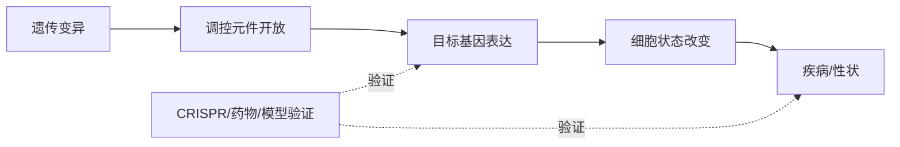

<a href="../../index.md">首页</a>›<a href="#">Part 5 多组学整合</a>›第 14 章

<header class="chapter-header">

  
14

  
Part 5 · 多组学整合

  <h1 class="chapter-title">多组学整合与研究路线图</h1>
  
整合的目标不是把数据堆在一起，而是让机制链条更清楚。

</header>

<nav class="chapter-toc"><h3>本章目录</h3><ol>
  <li>整合前先定义问题</li>
  <li>早期、中期和晚期整合</li>
  <li>常见整合场景</li>
  <li>因果链条和验证</li>
  <li>从学习到项目设计</li>
  <li>案例深读：iPOP 如何把多组学变成纵向机制链</li>
</ol></nav>

## 14.1整合前先定义问题

多组学整合失败的常见原因，是先测很多数据，再试图寻找一个故事。真正的整合应该从问题出发：想解释遗传风险、细胞状态、空间微环境、宿主-微生物互作，还是药物反应？不同问题需要不同数据层。

例如要解释 GWAS 位点，优先整合 ATAC、eQTL、单细胞表达和功能注释；要解释肿瘤免疫微环境，优先整合 scRNA、TCR、空间转录组和蛋白标记；要解释代谢性疾病，可能需要宿主转录组、微生物组、代谢组和饮食信息。

## 14.2早期、中期和晚期整合

早期整合把不同组学特征合并成一个大矩阵，适合预测模型，但容易受尺度和缺失值影响。中期整合在潜变量、网络或因子层面寻找共同结构，例如多组学因子分析。晚期整合先分别分析各组学，再在通路、候选基因或机制层面汇总，解释性强，适合生物学研究。

| 整合方式 | 思路 | 优势 | 风险 |
|---|---|---|---|
| 早期整合 | 特征直接拼接 | 适合预测 | 尺度、缺失和过拟合 |
| 中期整合 | 共享潜变量/网络 | 能发现共同结构 | 模型假设复杂 |
| 晚期整合 | 各自分析后汇总 | 解释清楚 | 可能错过跨层弱信号 |

## 14.3常见整合场景

scRNA + scATAC 可以连接细胞状态和调控元件。scRNA + TCR/BCR 可以把克隆扩增和细胞功能状态连接起来。scRNA + 空间转录组可以把细胞类型放回组织结构。GWAS + eQTL + ATAC 可以从遗传位点推断候选调控元件和靶基因。微生物组 + 代谢组 + 宿主转录组可以提出宿主-微生物-代谢物互作模型。

这些整合场景的共同点是：每一层提供不同证据，而不是重复同一个结论。真正有价值的整合会排除替代解释。例如表达升高到底来自细胞比例变化、调控增强、遗传效应还是微环境刺激，需要不同组学层共同约束。

## 14.4因果链条和验证

多组学可以提出因果链条，但不能自动证明因果。一个强机制链条通常包括时间顺序、空间定位、遗传或实验扰动、分子中介和功能表型。例如“风险 SNP 打开 T 细胞 enhancer，增强某基因表达，促进炎症因子释放，增加疾病风险”，每一段都需要证据。

## 14.5从学习到项目设计

设计一个多组学项目时，可以按下面路线走：

1. 写出一句核心问题，而不是技术清单。
2. 判断主要变化发生在遗传、表观、转录、蛋白、代谢、空间还是微生态层。
3. 选择一个主组学作为发现层，一个或两个组学作为解释层。
4. 在设计阶段平衡批次和样本量。
5. 预先定义主要比较、QC 标准和验证策略。
6. 分析时先各层独立成立，再做跨层整合。
7. 最后用功能实验或独立队列验证关键链条。

认知升级

多组学整合的高级目标，是把“某层发生了变化”推进到“这些层按某种机制顺序共同导致了表型”。

## 14.6案例深读：iPOP 如何把多组学变成纵向机制链

**为什么必须做多组学。** 单层数据通常只能看到一个投影。基因组给风险背景，转录组给表达状态，蛋白质组给执行层，代谢组给小分子状态，临床指标给表型锚点。真正的问题是这些层如何随时间一起变化。

**结果如何变成生物学结论。** Chen 等人在 Cell 2012 的 iPOP 研究中，对同一个人做纵向 multi-omics profiling。研究逻辑不是把多张热图放在一起，而是把基因组风险、感染期间的转录/蛋白/代谢动态、以及临床表型串成时间序列。这样可以看到某些分子层变化是否先于或伴随表型变化。

**这个案例教什么。** 多组学最适合解决“机制链条和时间顺序”的问题。它的风险是过拟合故事：如果没有清楚的主问题、时间点、验证层和扰动证据，多组学会比单组学更难解释。

**参考。** Chen et al. 2012. *Cell*. https://www.cell.com/cell/fulltext/S0092-8674(12)00166-3

